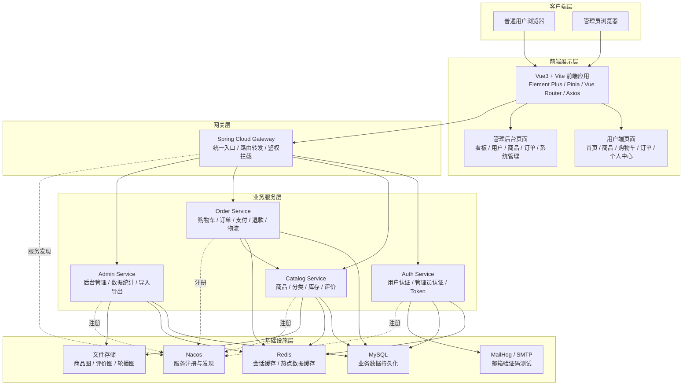
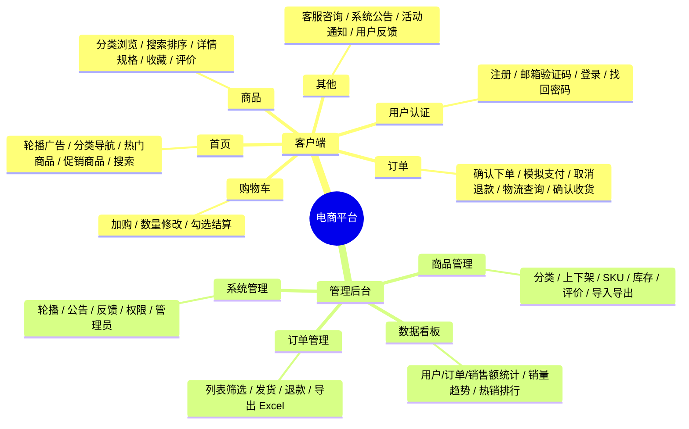
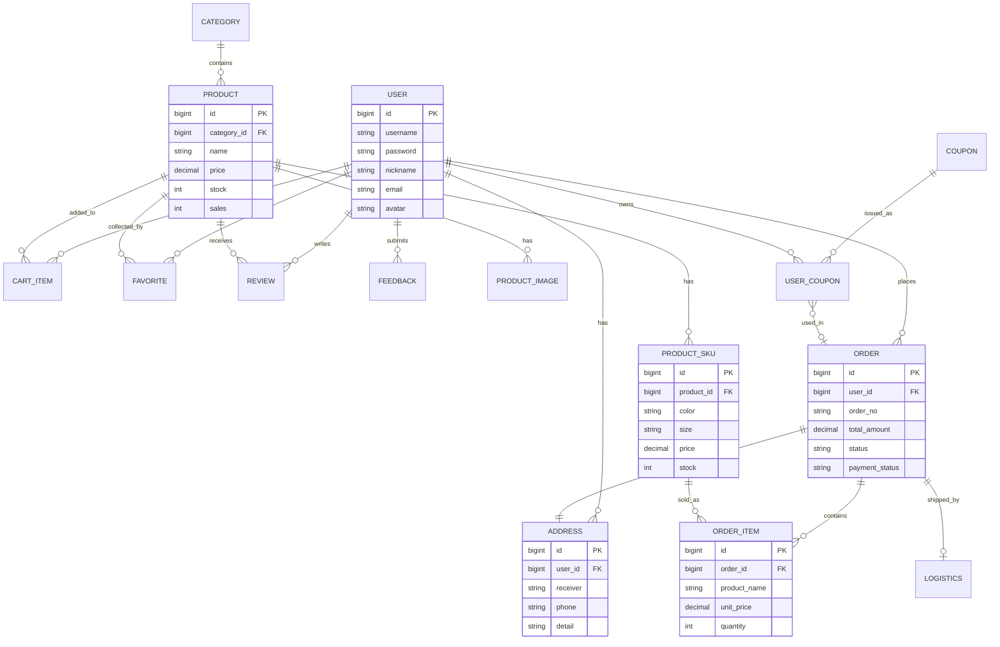
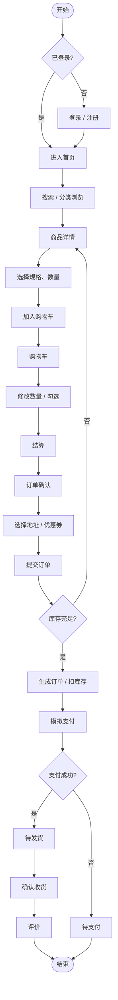
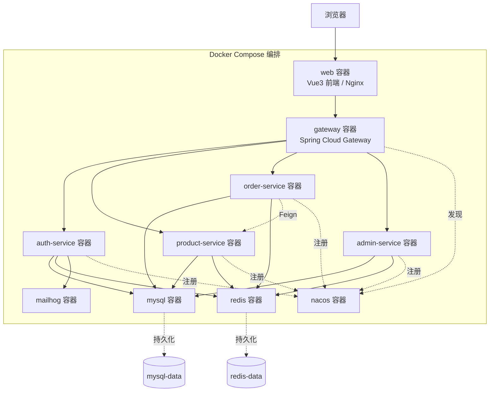

# Ecommerce Platform

《Web 开发技术》电商平台大作业。仓库采用团队式 monorepo：当前主演示和评分路径是 Vue 前台/后台 + Spring Cloud Gateway + 微服务栈，覆盖商城、后台、Nacos 注册发现、Redis 鉴权、OpenFeign 下单扣库存和 Docker 容器化；`legacy-web` 保留完整传统 Java Web 技术证据，作为 Servlet/JSP/Listener/Filter/JDBC 验收入口和 fallback。

## 技术栈与核心机制

### 缓存 — Redis

Redis 在本项目中承担两个核心职责：

1. **无状态会话鉴权**：用户/管理员登录后，auth-service 生成 UUID token，以 `session:{token}` → `{userId}:{role}` 的键值对写入 Redis（TTL 12h）。Gateway 的 `AuthGatewayFilter` 在每个请求到达业务服务前，从 `Authorization: Bearer {token}` 头中提取 token 查 Redis；命中则将 `X-User-Id` 和 `X-Role` 注入请求头放行，未命中返回 401。管理员路径额外校验角色，非 ADMIN/SUPER_ADMIN 返回 403。这样 Gateway 完全无状态，水平扩容不需要同步 session。
2. **邮箱验证码限流**：注册和重置密码时，验证码存入 `verify:{purpose}:{email}`（TTL 10min），同时写入 `verify:throttle:{purpose}:{email}`（TTL 1min）防止频繁发送。

### 微服务 — Spring Cloud Alibaba

四个业务服务 + 一个网关，全部注册到 Nacos：

| 服务 | 端口 | 数据库 | 职责 |
|------|------|--------|------|
| gateway-service | 18090 | — | 统一入口、路由转发、Redis 鉴权拦截、CORS |
| auth-service | 18091 | ecommerce_auth | 用户/管理员登录注册、邮箱验证码、会话管理 |
| product-service | 18092 | ecommerce_product | 商品/分类/库存/评价/收藏/文件上传 |
| order-service | 18093 | ecommerce_order | 购物车/订单/支付/退款/物流/地址 |
| admin-service | 18094 | ecommerce_product | 后台看板/统计/导入导出/客服 |

服务间调用使用 **OpenFeign**：order-service 通过 Feign Client 调 product-service 的 `/internal/products/{id}/order-view` 查商品信息和 `/internal/products/{id}/deduct-stock` 扣库存，Nacos 负责服务发现，Spring Cloud LoadBalancer 做客户端负载均衡。Gateway 通过 `StripPrefix=1` 将 `/api/auth/**` → auth-service `/auth/**`、`/api/products/**` → product-service `/products/**` 等路由规则分发请求。

### 容器化 — Docker Compose

`docker/docker-compose.yml` 一键编排全部组件：

- **MySQL 8.4**：首次启动通过 `docker-entrypoint-initdb.d` 按顺序执行 schema + seed SQL，自动创建 `ecommerce_auth`、`ecommerce_product`、`ecommerce_order` 三个库并灌入种子数据。数据持久化到 `./mysql/data`。
- **Redis 7 Alpine**：自定义 `redis.conf`，数据持久化到 `./redis/data`。Gateway 和 auth-service 通过容器内网络 `redis:6379` 访问。
- **Nacos 2.3.2**：单机模式，各服务启动后自动注册，Gateway 通过 `lb://service-name` 做负载均衡路由。
- **MailHog**：本地 SMTP 陷阱，auth-service 将验证码邮件发送到 `mailhog:1025`，前端通过 `http://localhost:18199` 查收。
- **5 个 Spring Boot 服务**：各自 Dockerfile 多阶段构建（Maven build → JRE 运行），通过环境变量注入 DB_URL、REDIS_HOST、NACOS_SERVER_ADDR 等连接信息，`depends_on` + `healthcheck` 保证启动顺序。
- **2 个 Nginx 前端容器**：Vue 构建产物由 Nginx 托管，`/api` 和 `/uploads` 反向代理到 Gateway。

启动命令：`docker compose -f docker/docker-compose.yml up -d --build`

## 系统总体架构



## 功能模块总览



## 核心数据库 ER 图



## 用户下单核心流程



## 微服务容器部署



## Repository Layout

```text
frontend/
  shop-web/            Vue 3 + Vite 商城前台
  admin-web/           Vue 3 + Vite 管理后台
backend/
  gateway-service/     Spring Cloud Gateway 微服务统一入口
  auth-service/        认证与会话服务
  product-service/     商品/分类/库存服务
  order-service/       购物车与订单服务
  admin-service/       后台聚合服务
  common/              公共响应与会话模型
  legacy-web/          单体回归与传统 Web 技术证据/fallback
docker/
  docker-compose.yml         默认微服务栈
  docker-compose.legacy.yml  legacy 单体对照栈
docs/
  course/              课程资料
  course/acceptance/   验收清单、评分证据、截图材料
  archive/             历史记录，仅作追溯参考
scripts/
  acceptance_check.sh
  microservices_smoke_test.sh
  build_microservices.sh
  create_submission_zip.sh
```

## Tech Stack

- Frontend: Vue 3, Vite, Element Plus, Pinia, ECharts
- Backend: Java 17, Spring Boot 3.2.4, Spring Cloud 2023.0.1, Spring Cloud Alibaba 2023.0.1.0, MyBatis, MySQL, Redis
- Microservices: Spring Cloud Gateway, Nacos Discovery, OpenFeign, Spring Cloud LoadBalancer
- Deployment: Docker Compose, Nginx, Nacos, MailHog local SMTP capture
- Course evidence: Servlet, JSP, Listener, Filter, JDBC

## Run Microservice Stack

```bash
./scripts/build_microservices.sh
npm --prefix frontend/shop-web install
npm --prefix frontend/admin-web install
npm --prefix frontend/shop-web run build
npm --prefix frontend/admin-web run build
docker compose -f docker/docker-compose.yml up -d --build
scripts/microservices_smoke_test.sh
```

URLs:

- Shop frontend: `http://localhost:18095`
- Admin frontend: `http://localhost:18082`
- Gateway: `http://localhost:18090`
- Auth service: `http://localhost:18091`
- Product service: `http://localhost:18092`
- Order service: `http://localhost:18093`
- Admin service: `http://localhost:18094`
- Nacos console: `http://localhost:18098/nacos`
- MailHog inbox: `http://localhost:18199`

The microservice smoke test checks Nacos registration, Gateway routing, Redis token authentication, `401/403` permission behavior, user/admin login, cart access, order creation, stock deduction, and Feign log evidence between `order-service` and `product-service`.

This is the primary classroom demo path. The product seed contains DummyJSON products with `cdn.dummyjson.com` image URLs and local `/catalog/...` paths, with brand, rating, discount, SKU variants, image gallery, specs, and reviews mapped into the existing tables.

## Run Legacy Evidence Stack

```bash
mvn -q -DskipTests package
npm --prefix frontend/shop-web install
npm --prefix frontend/shop-web run build
docker compose -f docker/docker-compose.legacy.yml up -d --build
./scripts/acceptance_check.sh
python3 scripts/acceptance_api_smoke.py
mvn test
```

Legacy is a traditional Web evidence and fallback path, not the only demo entry.

URLs:

- Frontend: `http://localhost:18081`
- Backend API: `http://localhost:18080/api`
- MailHog inbox: `http://localhost:18099`
- Legacy status page: `http://localhost:18080/legacy/status`

Default accounts:

- User: `alice / 123456`
- Super admin: `admin / admin123`

Email verification is a real SMTP flow. Docker starts MailHog and configures the backend to send verification emails to it; the frontend never receives a fixed code from the API. For automated monolith smoke testing, `scripts/acceptance_api_smoke.py` reads the verification code from MailHog through `ACCEPTANCE_MAILHOG_URL` (`http://localhost:18099` by default).

`mvn test` expects the legacy Docker MySQL, Redis, and MailHog dependencies to be running; the legacy compose stack exposes them on `13306`, `6380`, and `11025`.

By default the smoke test creates a real demo order and deducts product stock. To run a non-mutating environment check, use:

```bash
SUBMIT_ORDER=0 scripts/microservices_smoke_test.sh
```

## Submission Package

```bash
./scripts/create_submission_zip.sh
```

The package excludes `node_modules`, `target`, `dist`, browser profiles, uploads, logs, `.git`, and local submission artifacts.
