# 《Web开发技术》电商平台实验报告正文

## 一、实验目的

本实验围绕《电商平台》业务系统完成 Web 应用的分析、设计、开发、联调和测试。通过本项目，综合运用 Vue 3、Element Plus、Pinia、Spring Boot、Spring Cloud、Spring Cloud Alibaba、MyBatis、MySQL、Redis、Docker 等技术，实现面向消费者的商城前台和面向管理员的运营后台，掌握前后端分离系统的业务建模、接口设计、状态管理、权限控制、数据持久化、缓存优化、微服务拆分和容器化部署方法。

项目目标包括：完成商品浏览、购物车、下单支付、订单管理等电商核心流程；完成后台用户、商品、订单、营销和系统内容管理；实现认证鉴权、图片上传、分页、导入导出、响应式页面、Redis 缓存和 Docker 部署等进阶能力；通过自动化测试和真实页面检查保障系统可用性。

## 二、实验内容

本系统按照实验指导书的基础、进阶、拓展三层要求组织功能。表 2-1 将主要功能与实现位置进行对应，用于说明系统功能覆盖范围。

表 2-1 功能模块完成情况汇总

| 分类 | 模块 | 主要功能 | 对应页面/接口 |
| --- | --- | --- | --- |
| 客户端 | 商品 | 分类、列表、搜索、排序、详情、规格、收藏、评价 | `/products`、`/products/:id`、`/api/products`、`/api/reviews` |
| 客户端 | 购物车 | 加购、数量修改、删除、勾选、结算 | `/cart`、`/api/cart` |
| 客户端 | 订单 | 确认订单、支付、订单列表、取消、收货、退款、物流 | `/checkout`、`/pay/:id`、`/user/orders`、`/api/orders` |
| 客户端 | 用户中心 | 注册、登录、找回密码、资料、地址、优惠券、收藏、咨询 | `/login`、`/register`、`/user/*` |
| 管理后台 | 商品管理 | 分类管理、商品增删改查、上下架、导入导出、评价管理 | `/admin/products`、`/admin/categories`、`/admin/reviews` |
| 管理后台 | 订单管理 | 订单筛选、详情、发货、退款处理、状态修改、导出 | `/admin/orders` |
| 管理后台 | 系统管理 | 用户、管理员、轮播、公告、反馈、活动通知、客服咨询 | `/admin/users`、`/admin/banners`、`/admin/feedback` |
| 拓展 | 缓存/部署 | Redis 会话与缓存、Docker Compose、Spring Cloud Gateway、Nacos、OpenFeign | `deploy/docker-compose.legacy.yml`、`deploy/docker-compose.yml` |

### 2.1 客户端功能

客户端面向普通消费者，围绕“浏览商品、加入购物车、提交订单、查看个人信息”的购物闭环展开。

商品模块实现了分类浏览、商品列表、关键词搜索、价格/销量/新品排序、商品详情、规格展示、收藏与取消收藏、评价查看与评价提交。商品详情页展示商品图片、名称、价格、库存、销量、参数、详情介绍、规格和用户评价，并支持评价图片上传。

购物车模块实现了添加商品、购物车列表展示、数量修改、商品删除、勾选结算、全选/反选和小计/总价计算。购物车数据与后端数据库联动，用户登录后可跨页面查看购物车状态。

订单模块实现了订单确认、地址选择、商品清单展示、优惠券使用、订单提交、订单号生成、模拟支付、支付方式记录、我的订单列表、按状态筛选、取消订单、确认收货、申请退款和查看物流。

用户模块实现了注册、登录、退出登录、记住密码、找回密码、个人资料修改、头像上传、密码修改、收货地址增删改查、默认地址设置、优惠券列表、收藏列表、客服咨询、公告和活动通知展示。

### 2.2 管理后台功能

管理后台面向平台运营人员，主要用于商品、订单、用户和系统内容管理。

管理员认证模块实现了管理员登录、退出登录、Redis 会话校验和角色分级。系统内置超级管理员和普通管理员，超级管理员可访问用户管理、管理员账号管理、公告管理等高权限功能。

首页数据看板实现了总用户数、总订单数、总销售额、今日订单数、今日销售额、销量趋势、热销商品排行和订单状态统计，并使用 ECharts 展示图表。

用户管理模块实现了用户列表、分页、关键词搜索、用户新增、用户编辑、禁用/启用和删除。

商品管理模块实现了分类新增、编辑、删除、排序；商品列表、搜索、筛选、分页；商品新增、编辑、上下架、库存/价格调整、图片上传、逻辑删除和物理删除；商品评价列表和违规评价删除。

订单管理模块实现了订单列表、订单号/用户/状态筛选、订单详情、发货、取消、退款处理、状态修改和订单 Excel 导出。

系统管理模块实现了轮播图管理、公告管理、活动通知管理、用户反馈管理、客服咨询回复、管理员个人资料和密码修改。营销模块实现了优惠券、限时促销和促销活动管理。

### 2.3 拓展功能

项目引入 Redis 保存用户会话，并对首页数据和商品详情等热点数据进行缓存，减少重复数据库查询。项目提供 Docker Compose 配置，能够一次性启动 MySQL、Redis、后端服务和前端服务。项目还提供仓库级微服务部署，在提交包外层包含 `backend/gateway-service`、`backend/auth-service`、`backend/product-service`、`backend/order-service`、`backend/admin-service`、`frontend/shop-web` 等独立工程。微服务版本使用 Spring Cloud Gateway 作为统一入口，Nacos 作为服务注册发现中心，OpenFeign 完成订单服务到商品服务的远程调用，真实形成跨服务下单和扣库存链路。

## 三、实验环境

开发语言与框架：Java 17、Spring Boot 3.2.4、Spring Cloud 2023.0.1、Spring Cloud Alibaba 2023.0.1.0、Vue 3。

前端技术：Vite、Vue Router、Pinia、Element Plus、ECharts、Axios。

后端技术：Spring MVC、Spring Cloud Gateway、Nacos Discovery、OpenFeign、MyBatis、Spring Cache、Spring Data Redis、WebSocket、Apache POI。

数据库与中间件：MySQL 8、Redis 7、Nacos 2.3.2。

部署工具：Docker、Docker Compose、Nginx。

测试工具：JUnit 5、Spring Boot Test、MockMvc、接口冒烟脚本、浏览器页面截图检查。

## 四、系统设计与实现

### 4.1 总体架构

系统采用前后端分离架构。前端由 Vue 3 单页应用负责页面渲染、路由跳转、表单交互和状态管理；后端由 Spring Boot 提供 REST API，负责业务逻辑、鉴权、数据校验和文件处理；MySQL 保存用户、商品、购物车、订单、营销、公告、反馈等核心业务数据；Redis 保存登录会话和缓存热点数据；Docker Compose 负责本地和演示环境的一键部署。

常规部署下，前端通过 Vite 或 Nginx 访问后端 `/api` 接口。微服务部署下，前端统一访问 Spring Cloud Gateway，Gateway 通过 Nacos 发现 `auth-service`、`product-service`、`order-service` 和 `admin-service`，并在网关层完成 Redis token 校验、角色判断和用户身份透传。订单服务通过 OpenFeign 调用商品服务查询下单视图和扣减库存，避免仅停留在目录拆分。

图 4-1 系统总体架构图

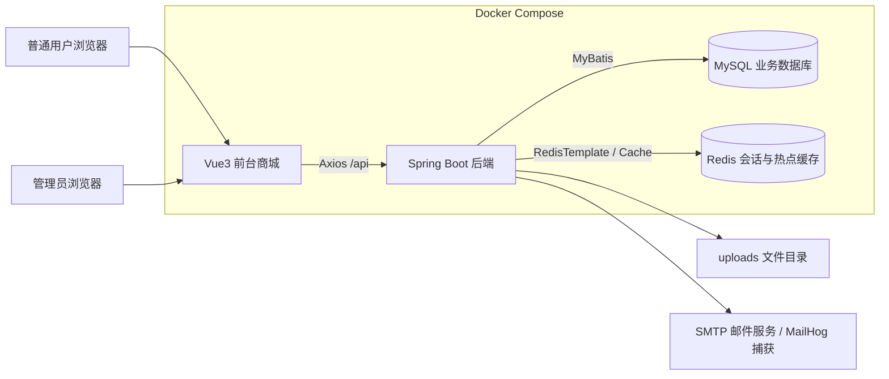
```mermaid
flowchart LR
  U[普通用户浏览器] --> FE[Vue3 前台商城]
  A[管理员浏览器] --> FE
  FE -->|Axios /api| BE[Spring Boot 后端]
  BE -->|MyBatis| DB[(MySQL 业务数据库)]
  BE -->|RedisTemplate / Cache| R[(Redis 会话与热点缓存)]
  BE --> FS[uploads 文件目录]
  BE --> Mail[SMTP 邮件服务 / MailHog 捕获]

  subgraph Docker Compose
    FE
    BE
    DB
    R
  end
```

图 4-2 微服务演示部署结构

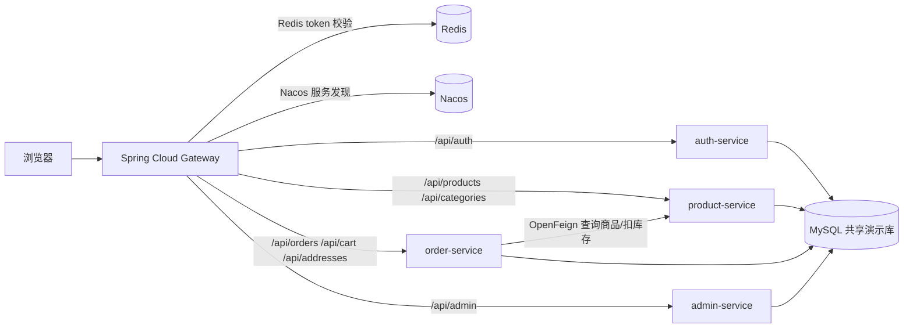
```mermaid
flowchart LR
  Browser[浏览器] --> G[Spring Cloud Gateway]
  G -->|Redis token 校验| R[(Redis)]
  G -->|Nacos 服务发现| Nacos[(Nacos)]
  G -->|/api/auth| Auth[auth-service]
  G -->|/api/products /api/categories| Product[product-service]
  G -->|/api/orders /api/cart /api/addresses| Order[order-service]
  G -->|/api/admin| Admin[admin-service]
  Order -->|OpenFeign 查询商品/扣库存| Product
  Auth --> DB[(MySQL 共享演示库)]
  Product --> DB
  Order --> DB
  Admin --> DB
```

### 4.2 数据库设计

数据库围绕电商业务对象建模，主要表包括：

用户与权限：`user`、`admin_user`、`verification_code`。

商品与营销：`product_category`、`product`、`product_spec`、`product_review`、`product_favorite`、`coupon`、`user_coupon`、`promotion`、`banner`。

购物与订单：`cart_item`、`user_address`、`orders`、`order_item`、`order_logistics`。

系统内容：`announcement`、`activity_notice`、`feedback`、`customer_consultation`。

其中订单表保存订单号、用户、地址、总价、支付状态、物流状态、退款状态、优惠券和支付方式；订单明细表保存每件商品的名称、规格、单价、数量和小计，保证历史订单不会因商品后续修改而失真。

图 4-3 核心数据关系图

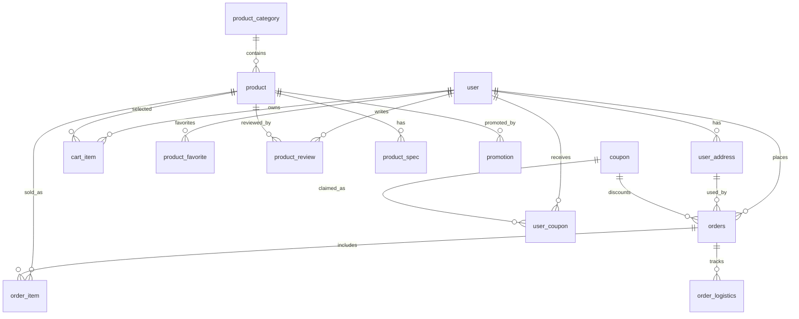
```mermaid
erDiagram
  user ||--o{ user_address : has
  user ||--o{ cart_item : owns
  user ||--o{ orders : places
  user ||--o{ product_favorite : favorites
  user ||--o{ product_review : writes
  user ||--o{ user_coupon : receives

  product_category ||--o{ product : contains
  product ||--o{ product_spec : has
  product ||--o{ cart_item : selected
  product ||--o{ order_item : sold_as
  product ||--o{ product_review : reviewed_by
  product ||--o{ promotion : promoted_by

  orders ||--o{ order_item : includes
  orders ||--o{ order_logistics : tracks
  user_address ||--o{ orders : used_by
  coupon ||--o{ user_coupon : claimed_as
  coupon ||--o{ orders : discounts
```

表 4-1 核心数据表说明

| 数据表 | 作用 | 关键字段 |
| --- | --- | --- |
| `user` | 普通用户信息 | `username`、`password`、`nickname`、`email`、`enabled` |
| `admin_user` | 管理员和角色 | `username`、`password`、`role` |
| `product` | 商品主表 | `category_id`、`name`、`price`、`stock`、`sales`、`is_on_sale` |
| `product_category` | 商品分类 | `parent_id`、`name`、`sort_order` |
| `cart_item` | 购物车明细 | `user_id`、`product_id`、`spec_text`、`quantity` |
| `orders` | 订单主表 | `order_no`、`user_id`、`total_amount`、`status`、`payment_status` |
| `order_item` | 订单商品明细 | `order_id`、`product_name`、`unit_price`、`quantity`、`subtotal` |
| `product_review` | 商品评价 | `user_id`、`product_id`、`rating`、`content`、`image_url` |
| `coupon` / `promotion` | 优惠券和促销 | `threshold_amount`、`discount_amount`、`promotion_price` |
| `feedback` / `customer_consultation` | 反馈和客服咨询 | `content`、`reply`、`status` |

### 4.3 认证与鉴权

普通用户和管理员分别通过登录接口获取 token。后端使用 Redis 保存 token 对应的用户 ID 和角色信息，拦截器对受保护接口进行统一校验。未登录访问购物车、订单、地址、收藏、后台接口时返回 401；普通用户访问后台管理接口时返回 403；超级管理员专属接口会进一步检查角色。

项目保留 Shiro 配置作为进阶鉴权方案，并通过 Spring Profile 控制是否启用。默认运行时使用轻量 Redis 会话拦截器，便于课程演示和接口测试。

图 4-4 登录鉴权流程图

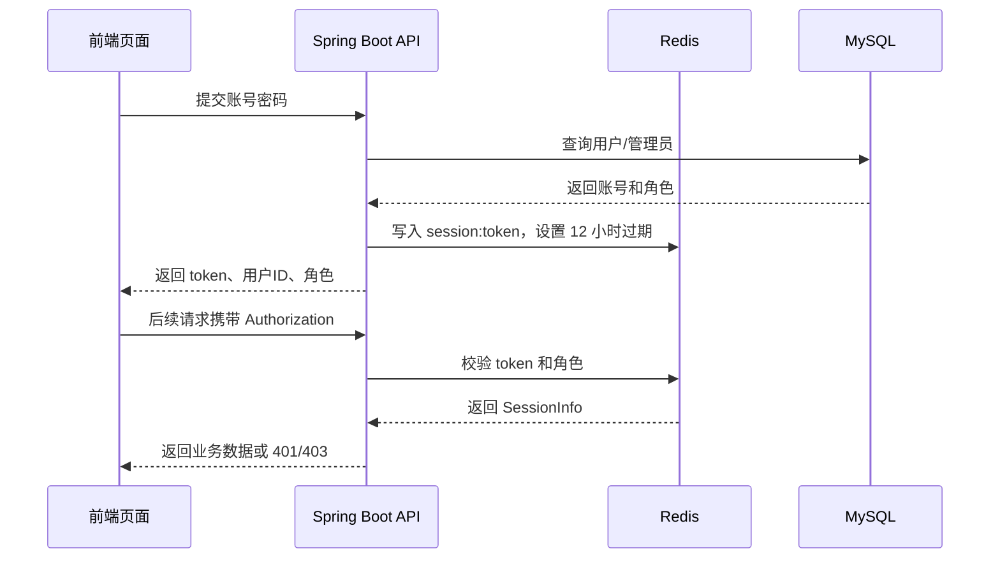
```mermaid
sequenceDiagram
  participant C as 前端页面
  participant API as Spring Boot API
  participant Redis as Redis
  participant DB as MySQL

  C->>API: 提交账号密码
  API->>DB: 查询用户/管理员
  DB-->>API: 返回账号和角色
  API->>Redis: 写入 session:token，设置 12 小时过期
  API-->>C: 返回 token、用户ID、角色
  C->>API: 后续请求携带 Authorization
  API->>Redis: 校验 token 和角色
  Redis-->>API: 返回 SessionInfo
  API-->>C: 返回业务数据或 401/403
```

### 4.4 商品与购物流程

商品列表接口支持分类、关键词、精准/模糊搜索、价格区间、排序和分页。商品详情接口返回商品基本信息，规格、促销、收藏状态和评价通过关联接口加载。

用户选择商品规格和数量后加入购物车。购物车页面支持数量修改、删除、勾选和结算。订单确认页加载默认地址、商品清单和优惠券，提交后生成订单号和订单明细。支付页支持模拟支付并记录支付方式，支付成功后订单进入待发货状态，后台可进行发货和状态处理。

图 4-5 客户端购物与订单状态流转

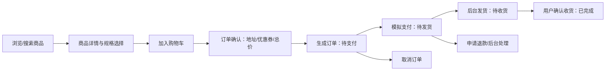
```mermaid
flowchart LR
  Browse[浏览/搜索商品] --> Detail[商品详情与规格选择]
  Detail --> Cart[加入购物车]
  Cart --> Checkout[订单确认：地址/优惠券/总价]
  Checkout --> Created[生成订单：待支付]
  Created --> Paid[模拟支付：待发货]
  Paid --> Shipped[后台发货：待收货]
  Shipped --> Done[用户确认收货：已完成]
  Created --> Cancel[取消订单]
  Paid --> Refund[申请退款/后台处理]
```

### 4.5 管理后台实现

后台采用统一布局，左侧菜单按商品、订单、内容、系统分组。商品、用户、订单、反馈等管理页面统一使用表格、搜索栏、分页、弹窗表单和操作按钮，减少学习成本。数据看板使用 ECharts 展示趋势和分布，支持数据导出。

后台文件上传用于商品图片、轮播图和头像。导入导出使用 Apache POI 生成 Excel 文件，商品导入支持 CSV 文件，订单和商品支持 Excel 导出。

### 4.6 缓存、部署与微服务

首页接口使用缓存保存轮播、热销商品和新品推荐。商品详情接口使用商品 ID 作为缓存键。用户登录会话保存到 Redis，并设置过期时间。退出登录时删除 Redis 会话，旧 token 立即失效。

根目录 Docker Compose 启动 MySQL、Redis、后端和前端服务，保证环境一致。微服务版本通过 `deploy/docker-compose.yml` 启动 MySQL、Redis、Nacos、Gateway、认证服务、商品服务、订单服务、后台聚合服务和前端服务。所有业务服务注册到 Nacos，Gateway 使用 `lb://` 路由转发到具体服务实例。

微服务鉴权集中在 Gateway 完成。登录成功后认证服务将 token 会话写入 Redis；非公开接口请求进入 Gateway 后读取 `Authorization: Bearer <token>`，校验成功后向下游添加 `X-User-Id` 和 `X-Role`。下游服务不再依赖前端传入的 `userId`，而是读取网关透传身份，降低越权风险。普通用户访问后台路径时由 Gateway 返回 403，未登录访问购物车和订单等私有路径时返回 401。

订单链路用于证明服务间调用真实存在。用户提交订单时，请求先经过 Gateway 到达 `order-service`；订单服务读取当前用户购物车和地址后，通过 OpenFeign 调用 `product-service` 的内部接口查询商品名称、价格、库存，再调用扣库存接口。商品不存在或库存不足时订单不会创建；扣库存成功后才写入订单主表和订单明细表。当前阶段各服务按业务域拆分，数据库仍共用 `ecommerce_minimal` 演示库，后续可演进为独立库或分布式事务方案。

### 4.7 前端技术使用与评分点对应

前端采用 Vue 3、Element Plus 和 Pinia，重点不是展示技术名称，而是让技术服务于采分项。Vue 3 用于组织前台、用户中心和后台管理页面；Element Plus 用于后台表格、表单、弹窗、分页、上传和操作反馈；Pinia 用于保存普通用户和管理员登录状态。这样能够对应进阶技术中的前端技术、界面设计、认证鉴权、分页和上传等要求。

前台页面围绕购买流程组织：首页负责导购，商品列表负责筛选和搜索，商品详情负责展示价格库存、规格、收藏和评价，购物车负责汇总商品，订单确认页负责地址和金额确认，支付页负责订单状态推进，个人中心负责订单、地址、资料、收藏、优惠券和客服咨询。用户可以从首页连续完成商品浏览、加购、结算、支付和订单查看，形成完整购买流程。

后台页面围绕管理效率组织：看板先展示运营数据，商品、分类、评价和订单页面承担核心运营，用户、轮播、公告、活动通知、反馈、客服咨询和管理员账号页面承担平台管理。后台大量使用表格、筛选、弹窗和操作按钮，符合管理员高频查询和维护的使用习惯。

响应式设计作为单独功能点处理。实验验证时检查了 390px 手机宽度和 768px 平板宽度下的导航、按钮、商品卡片和文本展示效果。前台小屏页面采用适合浏览的紧凑布局，后台管理端在移动宽度下使用抽屉式菜单，避免菜单平铺占满首屏；首页和商品卡片能够正常展示，页面在不同屏幕宽度下具有可用性。

### 4.8 后端能力与业务验证

后端采用 Spring Boot、MyBatis、MySQL 和 Redis，重点支撑接口可用、数据持久化和权限控制。本节不展开具体类代码，而是说明这些技术如何服务评分点：Spring Boot 提供 REST API，MyBatis 访问 MySQL，Redis 保存登录会话和热点缓存，统一鉴权区分公开接口、用户接口和后台接口。

普通用户接口覆盖商品、购物车、订单、地址、收藏、评价、优惠券、反馈和咨询。后台接口覆盖管理员登录、看板、用户、商品、分类、评价、订单、轮播、公告、活动通知、反馈、客服咨询、促销和管理员账号。接口范围与采分表基本对应，因此前端页面不是孤立静态页，而是通过后端数据驱动。

后端权限验证重点放在三类结果上。第一，未登录访问购物车、订单等用户私有接口应返回未登录；第二，普通用户访问后台接口应返回权限不足；第三，管理员访问后台管理接口应成功。接口冒烟测试已经覆盖这些鉴权隔离场景，说明用户端和后台端权限边界有效。

导入导出、上传、缓存和邮箱验证码属于影响系统完整性的功能点。导入导出用于支撑后台实用性；上传用于头像、商品图、轮播图和评价图片；缓存用于首页、商品详情和用户会话；验证码采用真实 SMTP 发送并在 Redis 中一次性校验，Docker 环境通过 MailHog 捕获邮件，避免课堂环境依赖外网邮箱。这些处理提高了系统在实验环境中的可演示性和稳定性。

### 4.9 接口设计与业务边界

本项目接口遵循 REST 风格，按资源模块划分路径。前台公开查询接口允许匿名访问，例如商品列表、商品详情、分类、首页、公告、活动通知、促销、优惠券和评价列表。涉及用户私有数据的接口必须登录，例如购物车、订单、地址、收藏、反馈、咨询、个人资料和密码修改。后台接口必须管理员登录，部分接口进一步要求超级管理员角色。

表 4-2 主要接口分组

| 接口分组 | 代表路径 | 说明 |
| --- | --- | --- |
| 认证接口 | `/api/auth/login`、`/api/auth/register/email`、`/api/auth/admin/login` | 用户注册登录、管理员登录、验证码、找回密码、退出登录 |
| 商品接口 | `/api/products`、`/api/products/{id}`、`/api/products/admin/*` | 商品查询、详情、后台商品管理、导入导出 |
| 分类接口 | `/api/categories`、`/api/admin/categories` | 前台分类查询与后台分类维护 |
| 营销接口 | `/api/marketing/coupons`、`/api/marketing/promotions` | 优惠券、用户券包、促销、商品规格 |
| 购物车接口 | `/api/cart`、`/api/cart/items` | 购物车增删改查 |
| 订单接口 | `/api/orders`、`/api/admin/orders` | 下单、支付、退款、物流、后台发货与导出 |
| 用户中心 | `/api/addresses`、`/api/favorites`、`/api/feedback`、`/api/consultations` | 地址、收藏、反馈、客服咨询 |
| 内容管理 | `/api/home/banners`、`/api/announcements`、`/api/activity-notices` | 轮播、公告、活动通知 |
| 文件上传 | `/api/files/upload` | 商品图、头像、评价图等文件上传 |

这种分组方式的优点是前端页面与接口模块对应清晰。例如商品详情页会同时调用商品详情、规格、促销、评价和收藏状态接口；订单确认页调用购物车、地址、优惠券和订单提交接口；后台商品管理页调用分类、商品列表、上传、导入和导出接口。接口边界清楚后，测试也可以按模块组织，便于对照评分表逐项验证。

### 4.10 数据初始化与演示稳定性设计

为了保证课堂演示环境稳定，项目提供 `schema.sql` 和 `data.sql` 两个初始化文件。`schema.sql` 负责建库建表，`data.sql` 负责插入演示账号、分类、商品、规格、优惠券、促销、评价、地址、购物车、订单、公告、活动通知、客服咨询和反馈。演示账号包括普通用户 `alice / 123456` 和管理员 `admin / admin123`。初始化数据使系统启动后即可展示商品、订单、图表和后台管理内容，减少手动构造数据的步骤。

测试和接口冒烟会创建临时分类、商品、订单、评价和上传文件。如果测试后不清理，前端首页可能出现“测试分类”或“导入测试商品”等临时数据，影响实验结果展示。因此项目提供 `scripts/reset_demo_data.sh`，用于重建 MySQL 演示库并清理 Redis，使数据库能够恢复到稳定的演示状态。脚本支持 `monolith`、`microservices` 和 `both` 三种目标，重置后只保留正常演示数据：用户、管理员、分类、商品、库存、轮播、促销、优惠券、地址、订单、评价、公告、反馈和客服咨询，不保留 QA、test、import、smoke 等临时痕迹。

促销种子数据采用动态有效期策略，结束时间为 `GREATEST('2026-12-31 23:59:59', DATE_ADD(NOW(), INTERVAL 180 DAY))`。这样无论演示前何时重置数据库，限时促销和秒杀活动都不会因为旧数据卷或日期推移而过期，保证首页促销入口、商品详情秒杀价和接口冒烟中的促销检查稳定通过。

验证码采用真实 SMTP 发送流程。系统生成 6 位随机验证码后写入 Redis，并通过邮件服务发送到用户邮箱；注册和找回密码接口必须校验 Redis 中的验证码，校验成功后立即删除，避免重复使用。为了保证本地验收不依赖外网邮箱，Docker 环境内置 MailHog 邮件捕获服务，接口冒烟脚本会从 MailHog 读取真实发送出的验证码。

## 五、实验过程与结果分析

开发过程先完成数据库建模和基础接口，再实现前端页面与路由，随后补充后台管理、营销活动、系统内容管理和拓展功能。联调阶段重点验证登录态、订单状态流转、图片上传、导入导出、Redis 会话和响应式页面。

后端使用 MockMvc 编写评分点覆盖测试，覆盖商品、购物车、订单、后台管理、用户认证、地址、规格、优惠券、轮播、反馈、导入导出、上传、分页、Redis 会话、逻辑删除、支付网关和管理员账号管理等功能点。当前后端测试结果为 71 个用例全部通过。

前端使用生产构建验证页面依赖和组件编译，`npm run build` 可正常生成构建产物。全栈运行时，前端首页、商品列表、商品详情、购物车、订单、个人中心、后台登录、后台看板、商品管理和订单管理页面均可访问。接口冒烟脚本覆盖登录、注册、资料、商品目录、收藏评价上传、地址购物车订单、后台管理和鉴权隔离流程。

针对课堂环境可能无法访问外部邮箱的问题，系统在 Docker 编排中加入 MailHog。后端仍然走 SMTP 协议发送邮件，前端不接收也不展示验证码；验收人员可以在 MailHog Web 页面查看邮件，也可以由接口冒烟脚本通过 MailHog API 读取验证码完成自动化注册和找回密码流程。

### 5.1 测试结果数据

表 5-1 构建与自动化测试结果

| 验证项 | 命令/方式 | 结果 | 说明 |
| --- | --- | --- | --- |
| 前端生产构建 | `npm run build` | 通过 | Vite 成功生成 `dist` 构建产物 |
| 后端单元/接口测试 | Docker MySQL/Redis/MailHog 启动后执行 `mvn test` | 通过 | `Tests run: 71, Failures: 0, Errors: 0, Skipped: 0` |
| 单体快速冒烟 | `./scripts/acceptance_check.sh` | 通过 | 前端、首页、商品、用户登录、管理员登录、鉴权、Servlet/JSP 证据均通过 |
| 单体完整 API 冒烟 | `python3 scripts/acceptance_api_smoke.py` | 通过 | 认证、商品、购物车、订单、后台管理、鉴权 8 组流程全部 PASS |
| 微服务验收测试 | `scripts/microservices_smoke_test.sh` | 通过 | Nacos 注册、Gateway 路由、401/403、登录、购物车、下单、库存扣减、Feign 日志全部 PASS |
| 微服务完整 API 冒烟 | `ACCEPTANCE_BASE_URL=http://127.0.0.1:18090/api ACCEPTANCE_MAILHOG_URL=http://127.0.0.1:18199 python3 scripts/acceptance_api_smoke.py` | 通过 | Gateway 入口下 8 组完整业务流程全部 PASS |
| 演示数据重置 | `scripts/reset_demo_data.sh both` | 通过 | 单体库和微服务库均可恢复干净演示数据并清理 Redis |
| 浏览器页面巡检 | Browser / 本地页面巡检 | 通过 | 首页、商品列表、商品详情、购物车、结算、订单、后台看板、商品、订单、用户、轮播、促销页面可访问 |
| 响应式巡检 | 390px、768px 视口 | 通过 | 后台 390px 下侧栏隐藏、菜单按钮可见、抽屉导航可打开，无横向溢出 |

表 5-2 接口冒烟测试覆盖结果

| 测试流程 | 覆盖内容 | 结果 |
| --- | --- | --- |
| 认证登录 | 普通用户登录、管理员登录 | PASS |
| 邮箱注册 | 真实 SMTP 验证码发送、邮箱注册、优惠券领取 | PASS |
| 资料与密码 | 个人资料修改、密码修改、找回密码 | PASS |
| 商品目录 | 分类、搜索、详情、规格、促销、优惠券 | PASS |
| 收藏评价上传 | 收藏、取消收藏、评价提交、图片上传 | PASS |
| 地址购物车订单 | 地址、购物车、下单、支付、退款、物流 | PASS |
| 后台管理 | 看板、用户、分类、商品、订单、公告、反馈、轮播、导入导出 | PASS |
| 鉴权隔离 | 未登录 401、普通用户访问后台 403 | PASS |
| 微服务链路 | Nacos 注册、Gateway 鉴权、OpenFeign 下单扣库存、双方日志证据 | PASS |

### 5.2 页面截图材料

以下截图作为页面运行结果，可与对应功能说明配合展示。

表 5-3 用户端截图索引

| 图号 | 内容 | 文件 |
| --- | --- | --- |
| 图 5-1 | 商城首页与活动入口 | `docs/course/acceptance/evidence/evidence-home.png` |
| 图 5-2 | 用户登录 | `docs/course/acceptance/evidence/evidence-login.png` |
| 图 5-3 | 用户注册 | `docs/course/acceptance/evidence/evidence-register.png` |
| 图 5-4 | 找回密码 | `docs/course/acceptance/evidence/evidence-forgot-password.png` |
| 图 5-5 | 商品列表 | `docs/course/acceptance/evidence/evidence-user-products.png` |
| 图 5-6 | 商品详情、规格和评价 | `docs/course/acceptance/evidence/evidence-product-detail.png` |
| 图 5-7 | 购物车 | `docs/course/acceptance/evidence/evidence-user-cart.png` |
| 图 5-8 | 订单确认 | `docs/course/acceptance/evidence/evidence-checkout.png` |
| 图 5-9 | 支付页面 | `docs/course/acceptance/evidence/evidence-pay.png` |
| 图 5-10 | 我的订单 | `docs/course/acceptance/evidence/evidence-user-orders.png` |
| 图 5-11 | 收货地址 | `docs/course/acceptance/evidence/evidence-user-addresses.png` |
| 图 5-12 | 收藏、优惠券、客服咨询 | `docs/course/acceptance/evidence/evidence-user-favorites.png`、`evidence-user-coupons.png`、`evidence-user-consultations.png` |
| 图 5-13 | 响应式页面 | `docs/course/acceptance/evidence/evidence-responsive-390.png`、`evidence-responsive-768.png` |

表 5-4 管理端截图索引

| 图号 | 内容 | 文件 |
| --- | --- | --- |
| 图 5-14 | 数据看板与 ECharts 图表 | `docs/course/acceptance/evidence/evidence-admin-dashboard.png` |
| 图 5-15 | 用户管理 | `docs/course/acceptance/evidence/evidence-admin-users.png` |
| 图 5-16 | 商品管理 | `docs/course/acceptance/evidence/evidence-admin-products.png` |
| 图 5-17 | 分类管理 | `docs/course/acceptance/evidence/evidence-admin-categories.png` |
| 图 5-18 | 订单管理 | `docs/course/acceptance/evidence/evidence-admin-orders.png` |
| 图 5-19 | 评价管理 | `docs/course/acceptance/evidence/evidence-admin-reviews.png` |
| 图 5-20 | 轮播、促销、公告和活动通知 | `evidence-admin-banners.png`、`evidence-admin-promotions.png`、`evidence-admin-announcements.png`、`evidence-admin-activity-notices.png` |
| 图 5-21 | 反馈与客服咨询 | `docs/course/acceptance/evidence/evidence-admin-feedback.png`、`evidence-admin-consultations.png` |
| 图 5-22 | Docker 与微服务页面 | `docs/course/acceptance/evidence/evidence-docker-main-frontend.png`、`evidence-docker-microservices-frontend.png` |

### 5.3 采分点映射

表 5-5 评分表对应完成度

| 评分部分 | 指标 | 实现说明 | 完成情况 |
| --- | --- | --- | --- |
| 基础-客户端 | 商品 | 分类、详情、搜索、排序、收藏、评价 | 完成 |
| 基础-客户端 | 购物车 | 加购、展示、修改、删除、勾选、结算 | 完成 |
| 基础-客户端 | 订单 | 确认、提交、支付、筛选、取消、收货、退款、物流 | 完成 |
| 基础-后台 | 管理员 | 登录、退出、角色校验 | 完成 |
| 基础-后台 | 数据 | 指标卡片、趋势图、热销排行、状态统计 | 完成 |
| 基础-后台 | 用户 | 列表、搜索、启用/禁用、详情 | 完成 |
| 基础-后台 | 商品 | 分类、商品、上下架、库存价格、删除、评价管理 | 完成 |
| 基础-后台 | 订单 | 列表、详情、发货、退款、导出 | 完成 |
| 进阶技术 | 前端/后端 | Element Plus、Pinia、Spring Boot、MyBatis、Shiro、Redis | 完成 |
| 进阶客户端 | 认证、首页、地址、规格、优惠券、客服、公告 | 完成 |
| 进阶后台 | 轮播、公告、反馈、个人中心、导入导出 | 完成 |
| 其它 | 响应式、上传、分页 | 完成 |
| 拓展 | Redis、微服务、Docker | 完成 |

### 5.4 用户端页面实现与截图分析

用户端是本系统最重要的业务入口，主要目标是让普通消费者完成从“进入商城、查找商品、查看详情、加入购物车、确认订单、完成支付、查看订单”的完整流程。为了避免报告只停留在功能罗列，本节按用户实际操作顺序说明各页面的设计和实现。

图 5-1 商城首页

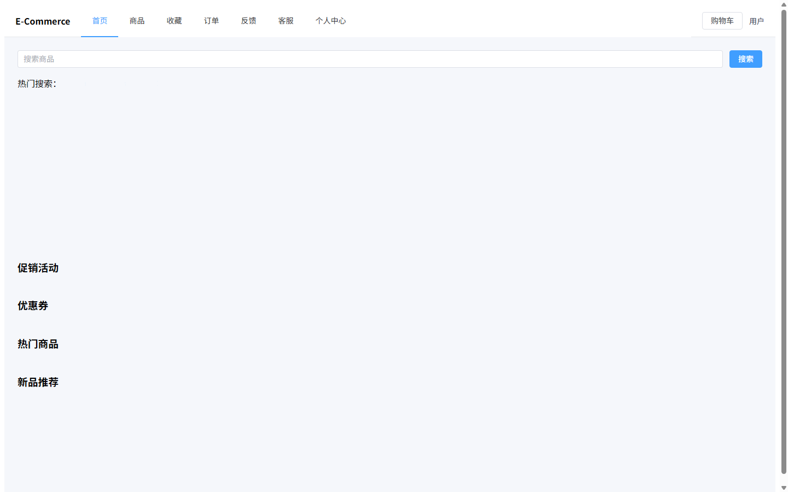

首页承担导购作用。页面顶部包含商城标识、搜索框、热门搜索词和购物车入口；中间区域包含商品分类、轮播活动、公告和促销卡片；下方展示热门商品和新品推荐。分类数据来自 `product_category` 表，轮播图来自 `banner` 表，热门商品和新品由首页接口聚合返回。首页接口使用缓存，适合承载高频访问。该设计说明系统不是单一商品列表页，而是具备电商首页、活动运营和商品推荐能力。

图 5-2 用户登录页面

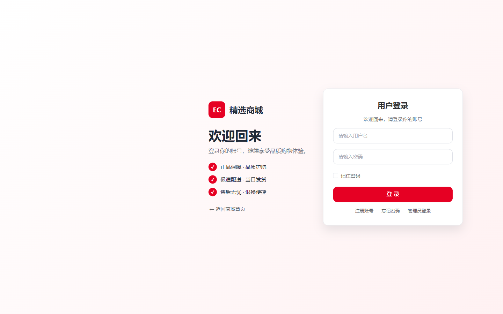

登录页提供用户名、密码、记住密码和管理员入口。普通用户登录成功后，前端保存 token、用户 ID 和昵称，后续购物车、订单、地址等接口都会携带该 token。登录页同时提供注册账号和忘记密码入口，形成完整认证闭环。种子数据提供默认用户 `alice / 123456`，可用于快速进入订单和个人中心等功能页面。

图 5-3 用户注册页面

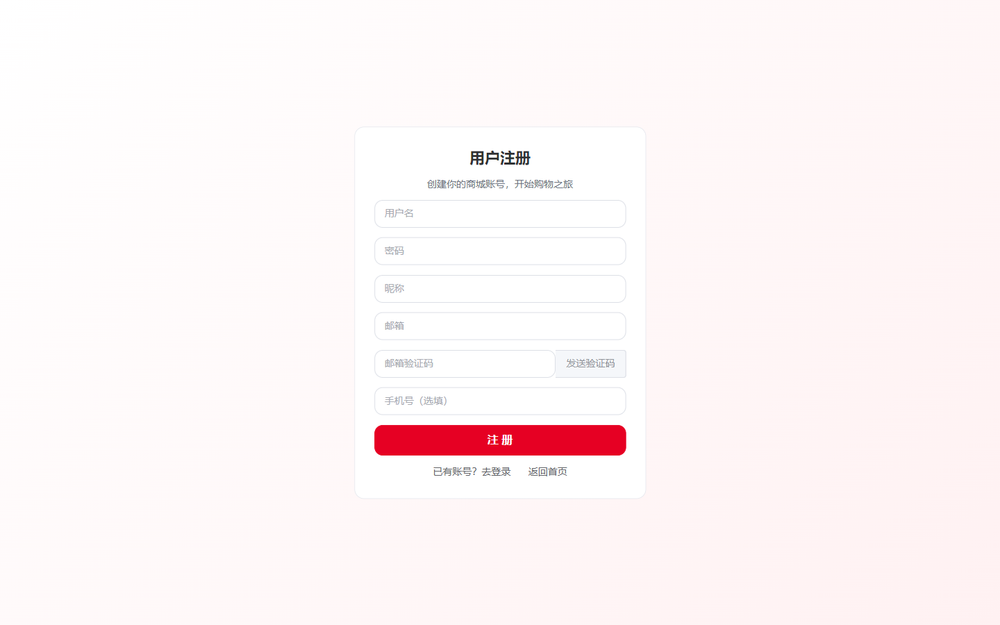

注册页包含用户名、密码、昵称、邮箱、验证码和手机号。系统支持邮箱验证码注册：后端生成 6 位随机验证码后写入 Redis，并通过 SMTP 邮件发送。Docker 环境内置 MailHog 捕获邮件，课堂验收无需外网邮箱授权；前端不会自动填入固定验证码，接口也不会把验证码作为响应返回。

图 5-4 找回密码页面

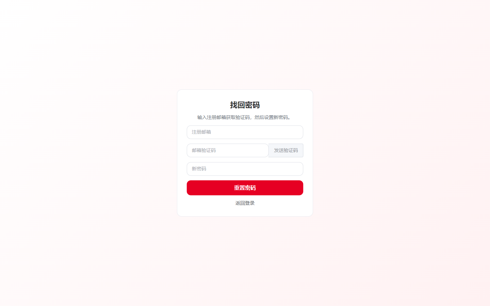

找回密码页复用了验证码机制。用户输入注册邮箱，获取验证码后设置新密码。后端校验 Redis 中保存的验证码，再根据邮箱更新用户密码。该流程和注册流程共用 `/api/auth/code` 发送验证码，但通过 `purpose=RESET` 区分用途，避免注册验证码和找回密码验证码混用。

图 5-5 商品列表页面

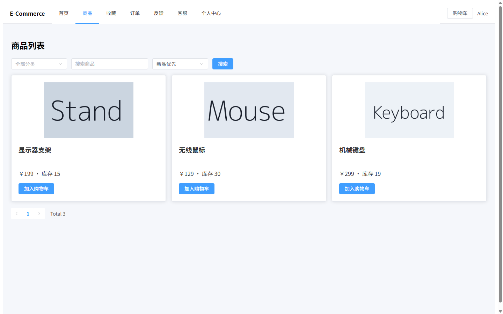

商品列表页是商品模块的核心页面，包含分类筛选、关键词搜索、价格区间筛选、综合/新品/销量/价格排序和分页。前端将筛选条件组合为 query 参数，后端按条件构造 SQL 查询并返回 `items` 与 `total`。商品卡片展示图片、名称、销量、价格、收藏按钮和加入购物车按钮。列表页既支持消费者浏览，也能直接触发收藏和加购操作。

图 5-6 商品详情页面

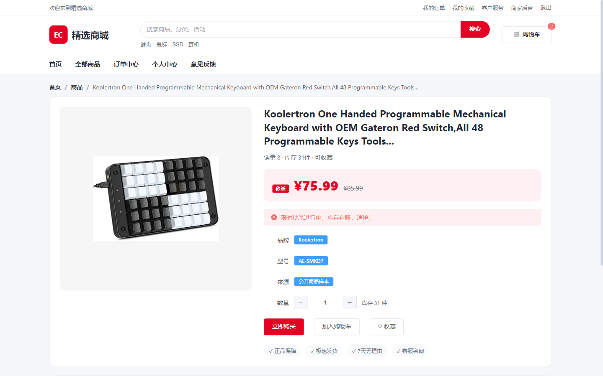

商品详情页展示商品图片、名称、价格、库存、规格、参数、详情介绍和评价。规格数据来自 `product_spec` 表，评价数据来自 `product_review` 表。用户可以选择规格和数量加入购物车，也可以收藏商品、上传评价图片并提交评价。详情页比列表页承担更多决策信息，因此页面重点展示商品参数、促销状态、用户评价和库存信息。

图 5-7 购物车页面

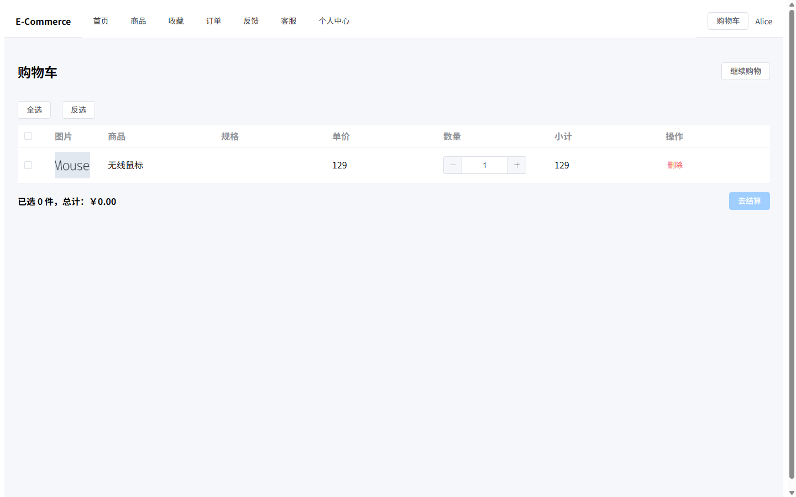

购物车页展示用户当前已加入的商品，包括图片、名称、规格、单价、数量和小计。用户可以修改数量、删除商品、勾选商品和进入结算。购物车表 `cart_item` 使用 `user_id + product_id + spec_text` 作为唯一约束逻辑，避免同一用户对同一规格重复创建多条记录。修改数量时后端直接更新数量，删除时按用户和商品删除，保证用户只能操作自己的购物车数据。

图 5-8 订单确认页面

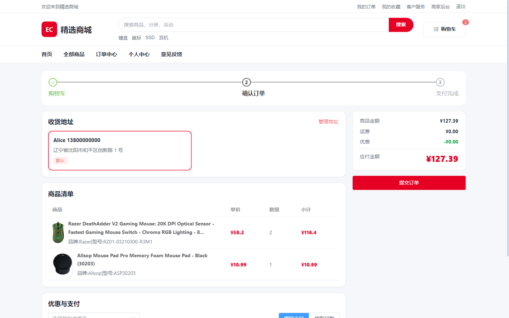

订单确认页是购物车到订单的过渡页面。页面加载用户地址列表、购物车商品、优惠券和价格汇总。用户可选择地址、使用优惠券并提交订单。后端下单时会根据购物车商品重新计算价格，而不是完全相信前端传入金额，避免前端价格被篡改。订单创建成功后生成订单号，并写入订单主表、订单明细表和物流表。

图 5-9 支付页面

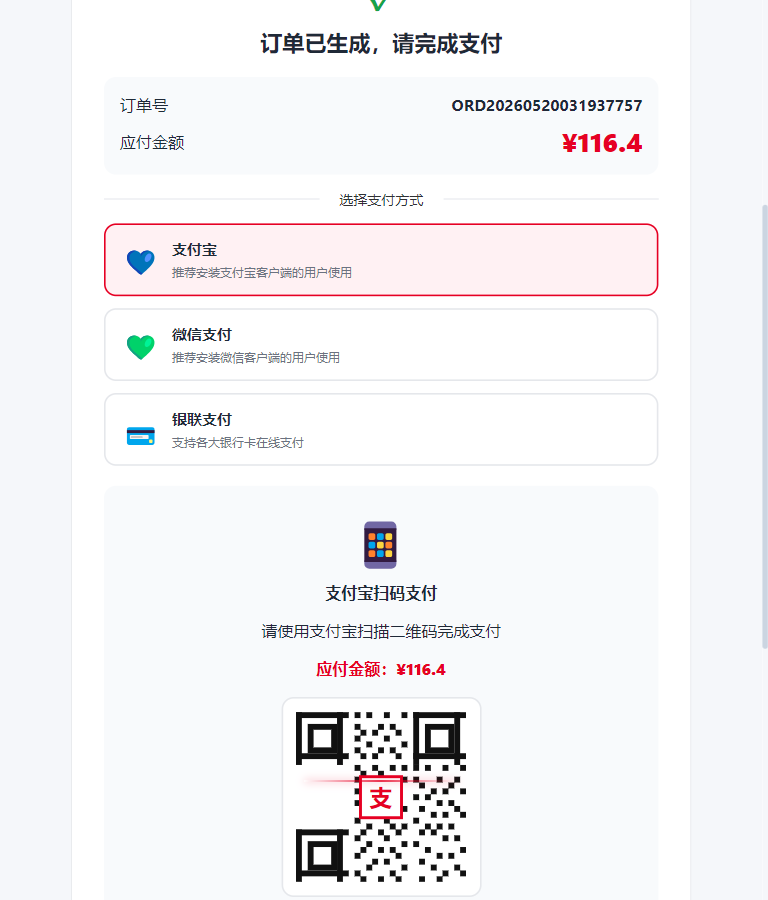

支付页实现模拟支付和支付方式记录。用户可以选择支付方式，系统调用支付接口后将订单支付状态改为已支付，并记录支付方式。项目没有接入真实第三方支付网关，但保留了 `/pay-gateway` 接口记录方式，用于表现“对接支付接口”的扩展点。对于课程实验而言，模拟支付能够完整展示订单状态变化。

图 5-10 我的订单页面

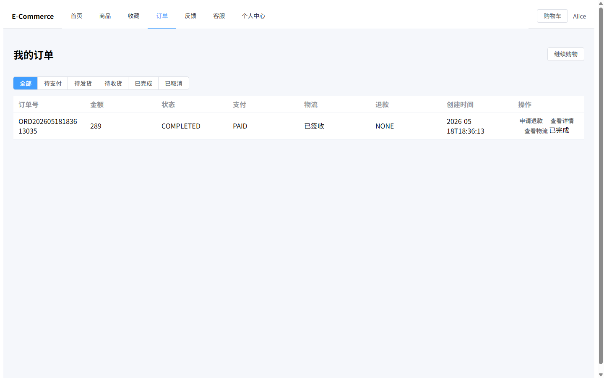

我的订单页按全部、待支付、待发货、待收货、已完成、已取消等状态组织订单。用户可以取消待支付订单、支付订单、确认收货、申请退款、查看物流和查看订单详情。订单状态使用 `status`、`payment_status`、`logistics_status`、`refund_status` 多字段表达，比单一状态字段更接近真实电商系统。比如一个订单可以是已支付但待发货，也可以是已支付并申请退款。

图 5-11 收货地址页面

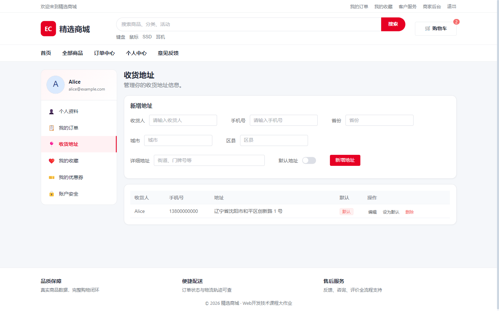

地址页支持新增、编辑、删除和设为默认地址。地址表保存收货人、手机号、省、市、区、详细地址和默认标记。设置默认地址时，后端会先取消该用户其他默认地址，再设置当前地址为默认，避免出现多个默认地址。订单确认页会优先使用默认地址，提升下单效率。

图 5-12 用户资料与账号安全

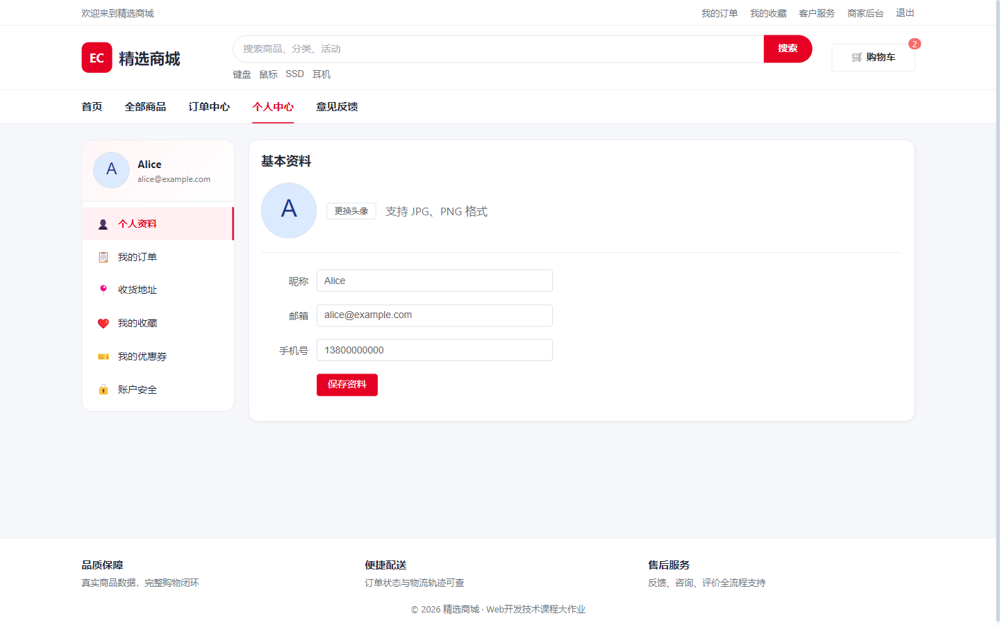

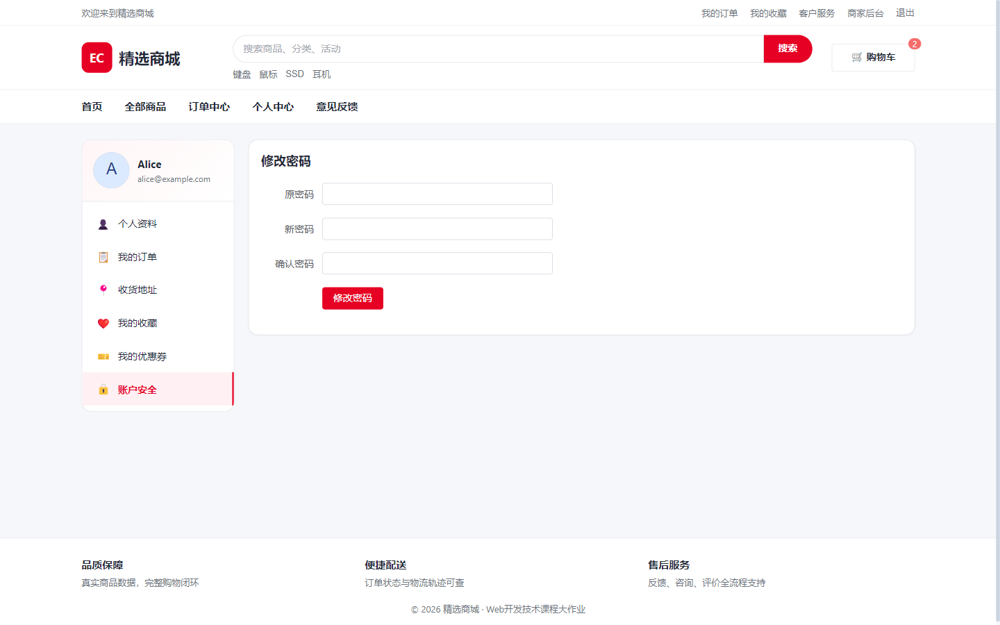

用户资料页支持头像、昵称、邮箱和手机号修改。头像通过文件上传接口保存，返回文件路径后写入用户表。账号安全页支持修改密码，后端会校验原密码，只有原密码正确才允许更新。这部分功能对应指导书中的“个人信息修改”和“密码修改”要求。

图 5-13 收藏、优惠券和客服咨询

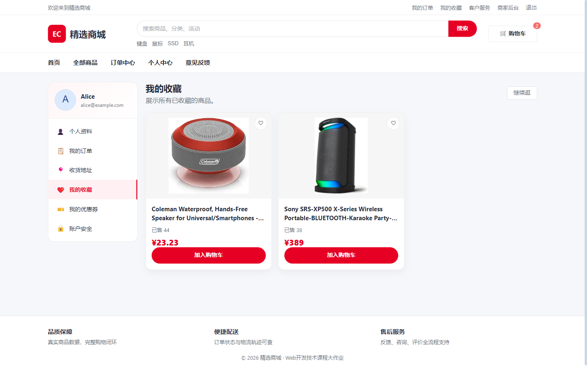

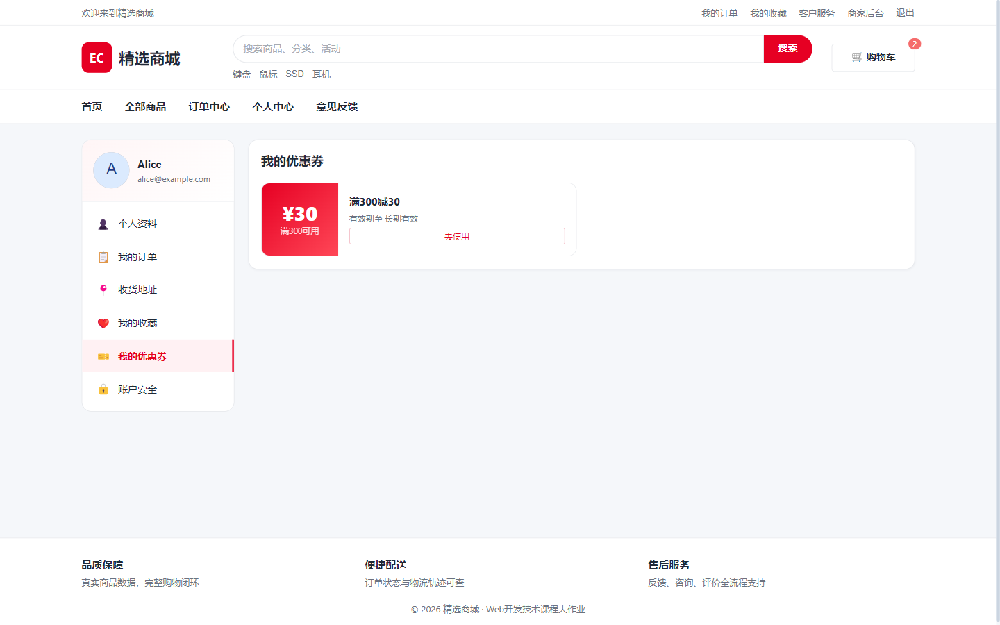

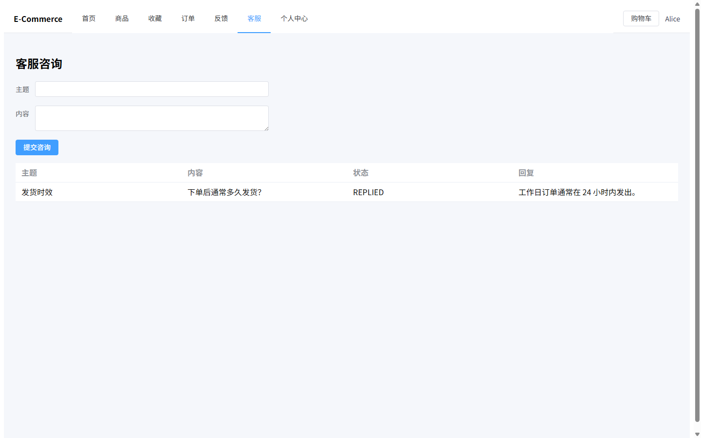

收藏列表用于用户保存感兴趣商品，优惠券列表展示用户已领取优惠券，客服咨询用于提交问题并查看管理员回复。这三类功能虽然不是下单必要步骤，但能体现平台的用户留存和售后服务能力。收藏表采用用户与商品的多对多关系；优惠券通过 `user_coupon` 表记录领取和使用状态；客服咨询保存用户提问、管理员回复和处理状态。

图 5-14 响应式布局

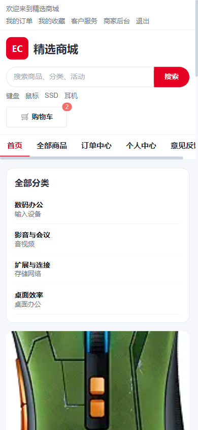

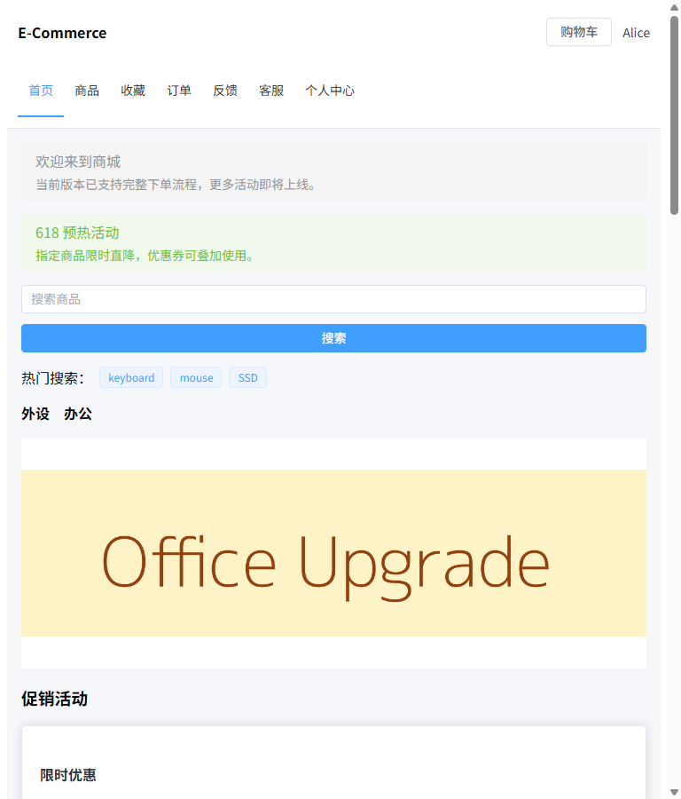

响应式截图展示了系统在手机和平板宽度下的布局效果。首页在小屏幕下改为单列，商品卡片缩小图片和按钮尺寸，避免内容溢出；后台管理端在移动宽度下改用抽屉式菜单，避免侧边栏或菜单项挤占表格内容。响应式布局不是简单把桌面页面压缩，而是根据移动端浏览和管理场景调整信息顺序。

### 5.5 管理后台页面实现与截图分析

管理后台强调效率和信息密度。与前台商品展示不同，后台页面更多使用表格、搜索条件、分页、弹窗表单和操作按钮，便于管理员快速定位数据并执行管理动作。

图 5-15 管理后台数据看板

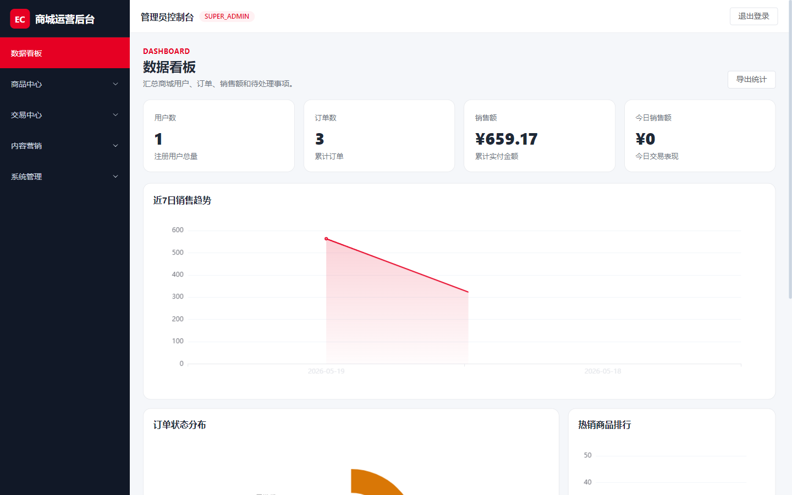

数据看板展示总用户数、总订单数、总销售额、今日订单数和今日销售额，并通过图表展示销量趋势、热销商品排行和订单状态分布。看板数据来自订单、用户和商品相关表。图表使用 ECharts 实现，比纯数字更直观。看板还支持导出 Excel，用于体现数据统计导出能力。

图 5-16 用户管理

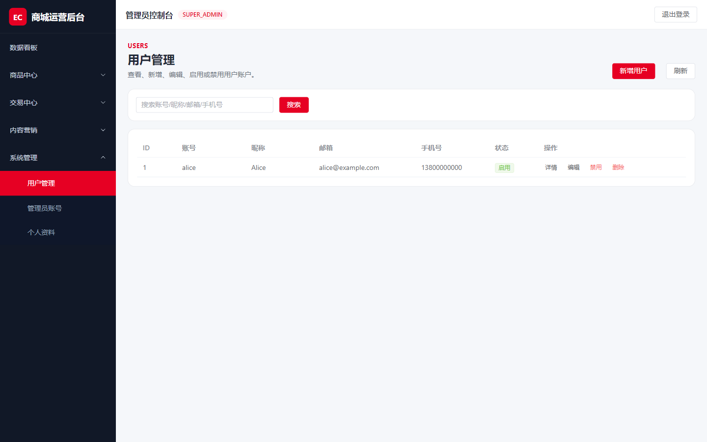

用户管理页支持分页、关键词搜索、新增用户、编辑用户、禁用/启用和删除。用户启用状态保存在 `enabled` 字段中。禁用用户后，该用户不能正常完成需要登录的业务操作。用户管理入口仅超级管理员可见，普通管理员不应拥有用户账号管理权限。

图 5-17 管理员账号管理

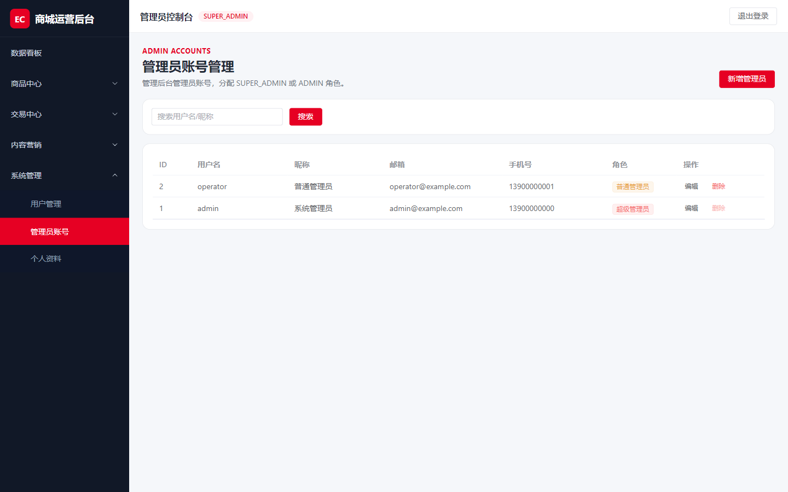

管理员账号管理用于维护后台管理员。系统区分 `SUPER_ADMIN` 和 `ADMIN` 两种角色。超级管理员可以新增、编辑和删除普通管理员；普通管理员只能访问自己权限范围内的后台功能。这体现了权限分级管理能力，也避免所有后台用户都具备最高权限。

图 5-18 商品管理

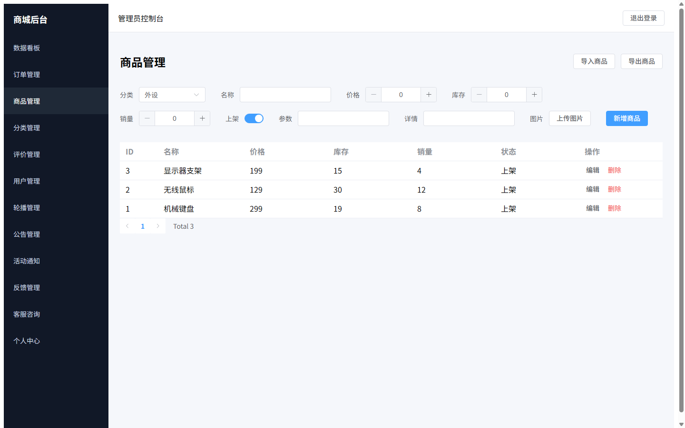

商品管理页支持商品列表、搜索、上下架、编辑、新增、图片上传、导入和导出。商品删除采用逻辑删除和物理删除两种方式：普通删除将商品下架并清零库存，保留历史记录；强制删除则彻底移除商品。实际电商系统通常更推荐逻辑删除，因为历史订单仍需要引用商品名称、价格和图片。

图 5-19 分类管理

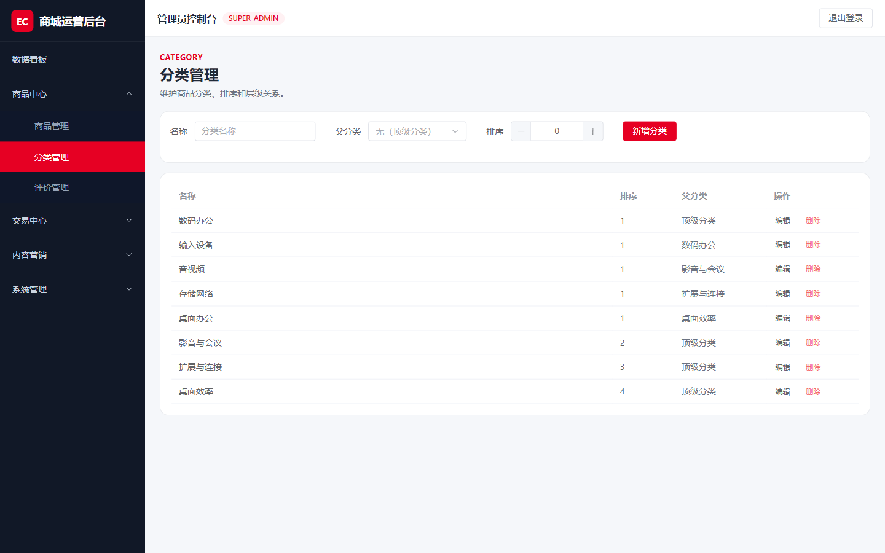

分类管理页支持新增、编辑、删除和排序。分类表使用 `parent_id` 表示一级和二级分类关系，前台首页会将父分类和子分类组合展示。分类排序字段用于控制页面展示顺序，避免只能按数据库 ID 排列。

图 5-20 商品评价管理

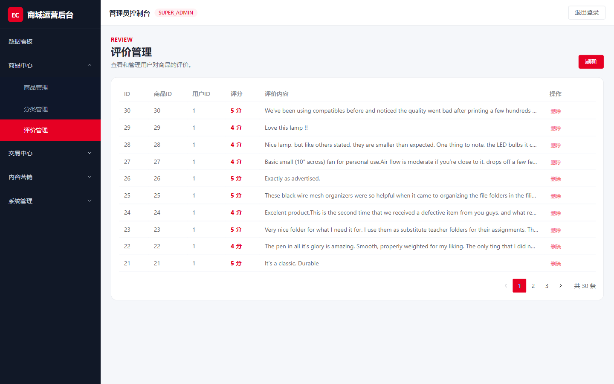

评价管理页展示用户评价列表，管理员可以删除违规评价。评价系统是电商平台信任机制的一部分，前台用户可以查看评价，后台管理员则负责内容治理。评价表支持图片字段，满足指导书中“上传评价图片”的要求。

图 5-21 订单管理

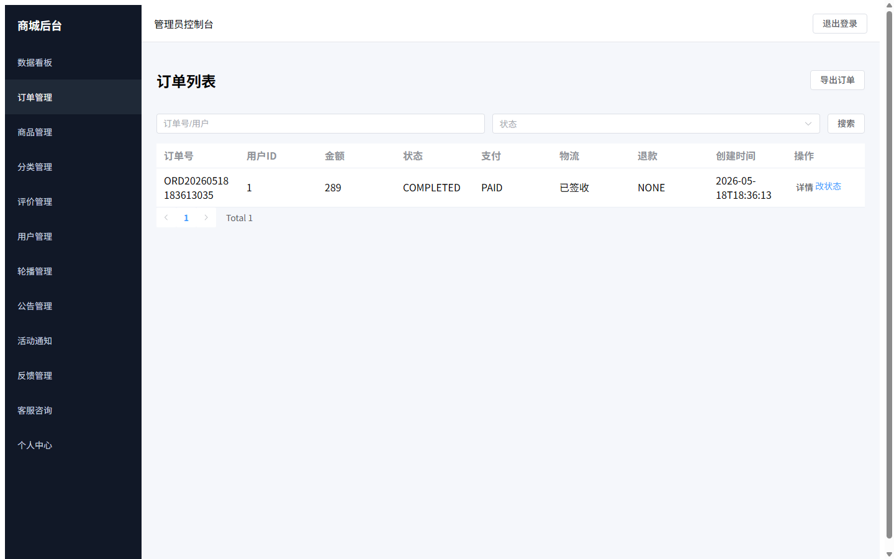

订单管理页支持订单号、用户和状态筛选，管理员可以查看订单详情、发货、处理退款、修改订单状态和导出订单。订单详情中包含商品、地址、支付和状态信息。后台发货会写入物流轨迹，用户端随后可在订单页查看物流信息。该功能连接了用户端和管理员端，是前后端联调中最能体现业务闭环的部分。

图 5-22 轮播和促销管理

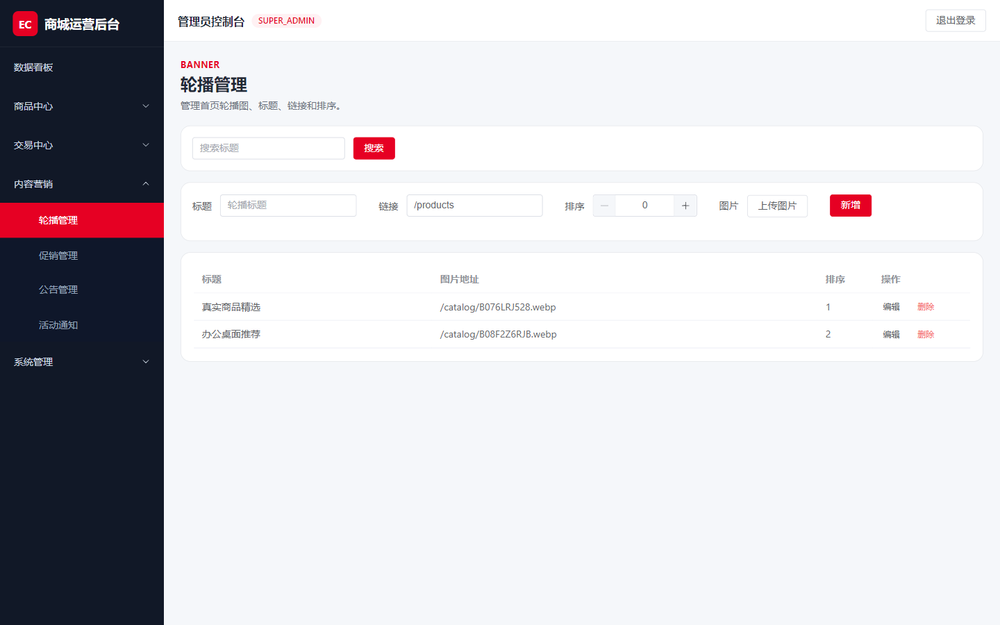

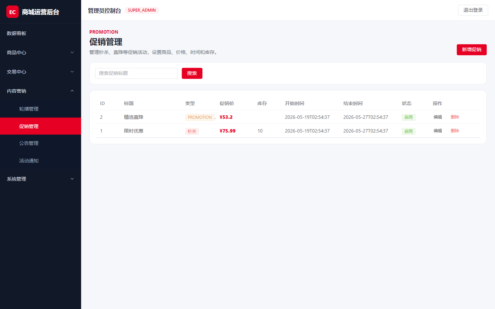

轮播管理用于维护首页活动图、跳转链接和排序；促销管理用于维护商品促销类型、促销价、促销库存和活动时间。前台首页和商品详情会读取这些数据。这样管理员不需要修改代码，就可以调整首页活动和商品营销信息。

图 5-23 公告和活动通知

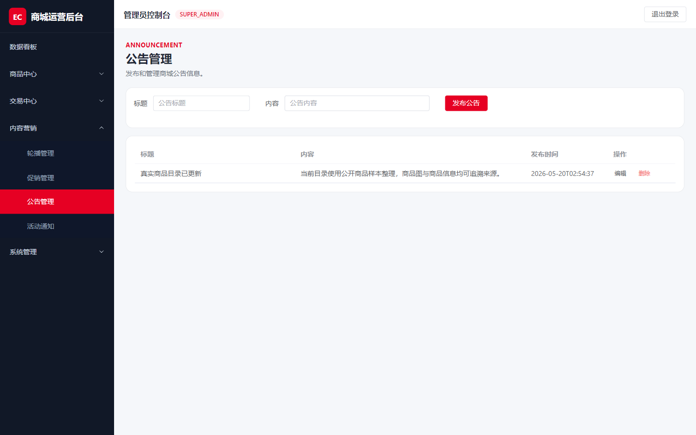

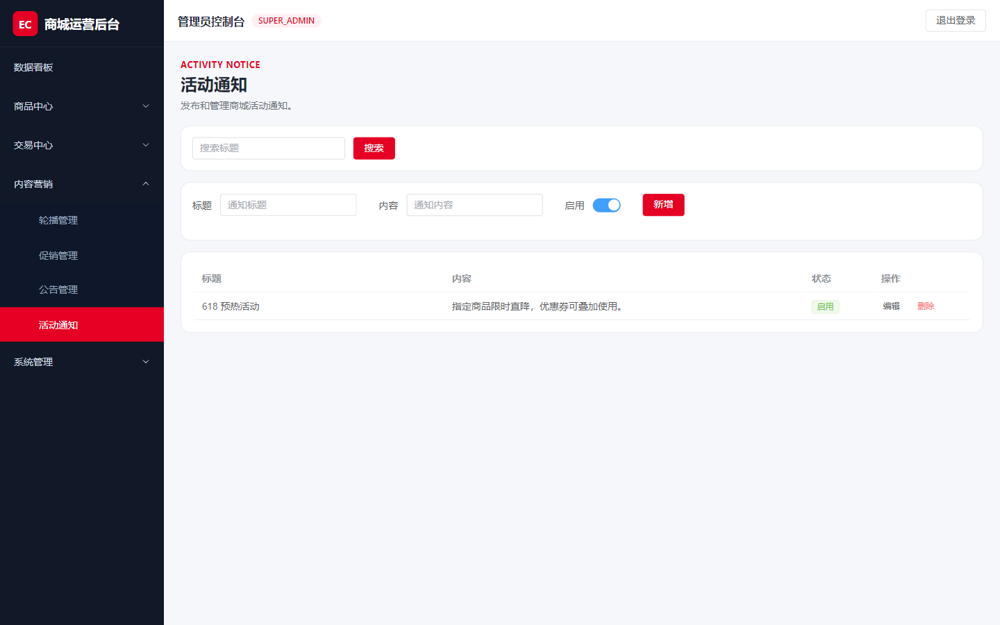

公告和活动通知用于平台内容发布。公告偏向长期平台信息，活动通知偏向当前运营活动。两类内容均支持后台新增、编辑和删除，前台首页会展示最新信息，增强平台运营感。

图 5-24 反馈与客服咨询

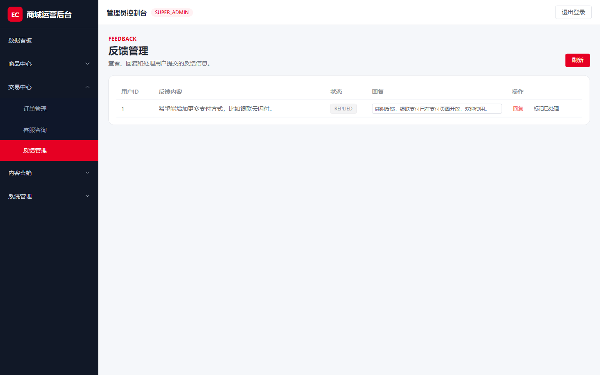

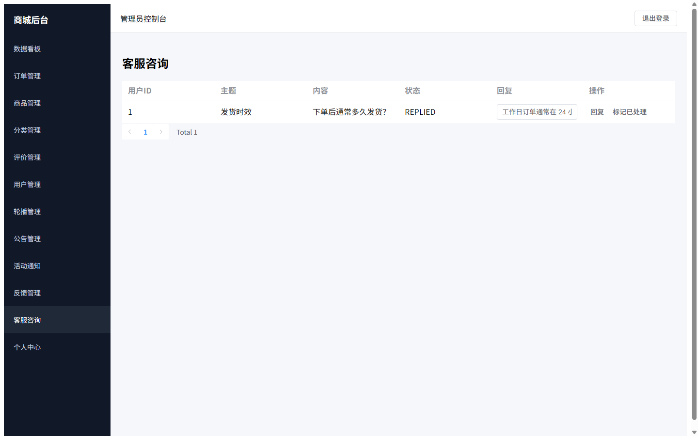

反馈管理用于处理用户建议和问题；客服咨询用于回复用户提交的咨询。管理员可以填写回复并标记已处理。前台用户提交反馈或咨询后，后台可实时看到对应记录。这部分功能支撑指导书中“客服咨询、用户反馈、反馈管理”的进阶要求。

图 5-25 管理员个人中心

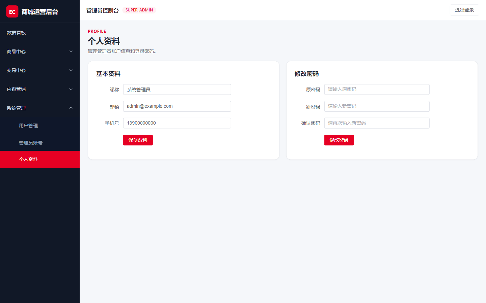

管理员个人中心支持资料修改和密码修改。该页面虽然功能较小，但能体现后台账号体系的完整性。管理员不需要直接操作数据库即可维护自己的联系方式和登录密码。

图 5-26 Docker 与微服务部署截图

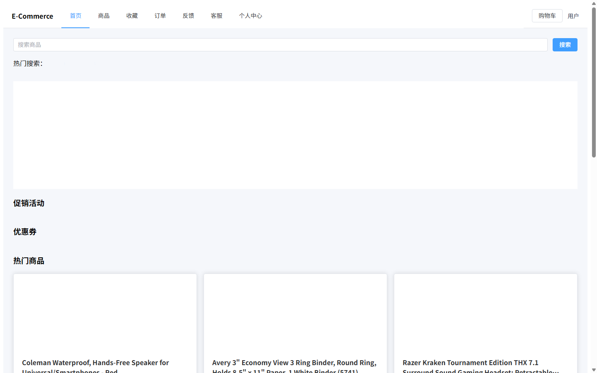

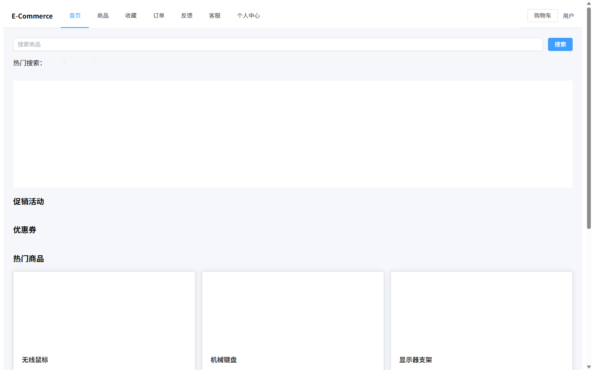

Docker 主栈截图说明项目可以通过容器启动完整前后端环境。微服务截图说明默认架构通过网关路由到不同服务实例，并由 Nacos 维护注册发现。对于课程实验来说，微服务不需要达到生产级服务治理，但需要展示模块拆分、网关转发、独立部署和跨服务调用思路。

微服务验收还需要保留 Nacos 服务列表、Docker Compose 服务状态、Gateway 商品接口、401/403 鉴权结果、自动化 smoke test、库存前后变化以及 Feign 双方日志截图。自动化脚本 `scripts/microservices_smoke_test.sh` 会生成真实测试订单并扣减库存，输出 `MICROSERVICES SMOKE TEST PASSED` 和 `PASS stock deducted ...` 后，可作为微服务链路已落实的直接证据。

### 5.5.1 课堂演示路线

课堂演示准备两套路由。第一套是默认微服务版，作为主展示入口：前台为 `http://localhost:18095`，后台为 `http://localhost:18082`，Gateway 为 `http://localhost:18090`，Nacos 控制台为 `http://localhost:18098/nacos`。演示顺序为：首页轮播、分类和促销；商品列表搜索、排序和详情；用户 `alice / 123456` 登录；购物车、结算、模拟支付、我的订单；管理员 `admin / admin123` 登录后台；数据看板、商品管理、订单管理、用户管理、轮播和促销管理；最后展示 Nacos 中 `ecommerce-gateway`、`ecommerce-auth-service`、`ecommerce-product-service`、`ecommerce-order-service`、`ecommerce-admin-service` 注册在线，以及下单时 order-service 通过 OpenFeign 调用 product-service 查询商品并扣减库存。

第二套是 legacy 单体版，用于传统 Web 技术证据、Servlet/JSP/Filter/Listener/JDBC 展示和接口回归对照。入口为 `http://localhost:18081`，后端接口为 `http://localhost:18080/api`，MailHog 为 `http://localhost:18099`。演示重点是证明同一套业务在单体中仍可完整运行，并保留指导书要求的传统 Java Web 技术证据页 `/legacy/status`。

### 5.6 关键业务流程分析

从用户视角看，最核心的流程是“登录 - 浏览商品 - 加入购物车 - 提交订单 - 支付 - 查看订单”。该流程横跨用户、商品、购物车、地址、订单、支付和物流等多个模块。实现时不能只关注单个页面能否显示，还要保证页面之间的数据能够连续流转。例如商品详情页选择规格后写入购物车，购物车结算页读取同一条购物车记录，订单确认页生成订单后从购物车删除或标记结算，支付页再修改订单支付状态，最后订单中心展示最新状态。

从管理员视角看，最核心的流程是“维护商品 - 查看订单 - 发货 - 处理售后 - 查看数据”。商品管理决定前台展示内容，订单管理决定交易履约，反馈和客服咨询决定售后处理，数据看板帮助管理员了解运营情况。后台和前台不是两个孤立系统，而是共享同一套数据库和接口：管理员新增商品后，用户端商品列表可以看到；管理员发货后，用户端物流轨迹会更新；管理员回复咨询后，用户端客服页面能看到回复。

从数据角度看，系统通过订单主表和订单明细表拆分保证交易记录稳定。订单主表记录订单号、用户、地址、总价和状态，订单明细表记录下单当时的商品名称、规格、单价和数量。这样即使后台后续修改商品价格或名称，历史订单仍能保留当时交易信息。该设计比订单只保存商品 ID 更可靠。

从权限角度看，系统将公开浏览、用户私有数据和后台管理分开。商品浏览、首页、公告和促销属于公开数据；购物车、订单、地址、收藏属于用户私有数据；用户管理、商品管理、订单管理和系统内容属于后台管理数据。后端拦截器统一处理 token 和角色，避免在每个控制器中重复写鉴权逻辑。

从微服务角度看，订单创建不再只是在同一服务内读取商品表，而是由 `order-service` 通过 OpenFeign 调用 `product-service` 查询商品下单视图并扣减库存。日志中可以同时看到订单服务的 `Feign call product-service productId=...` 和商品服务的 `Internal order query/deduct stock productId=...`，说明下单链路已经跨过服务边界。

### 5.7 测试设计与质量保障

为了避免“页面看起来有，但接口不可用”的问题，项目提供了后端测试和接口冒烟测试两层验证。

后端测试使用 JUnit 5、Spring Boot Test 和 MockMvc。测试类 `EcommerceScoringTests` 按评分点组织，每个测试名称都标注了对应采分点。例如商品分类浏览、商品详情、商品搜索、商品排序、商品评价、购物车添加、购物车列表、订单提交、订单支付、管理员登录、数据看板、用户管理、商品管理、订单导出、邮箱注册、找回密码、地址管理、商品规格、优惠券、轮播图、公告、反馈、导入导出、分页、文件上传、客服咨询、活动通知、Redis Session 销毁、商品逻辑删除、促销管理、支付网关和管理员账号管理等。

接口冒烟脚本 `scripts/acceptance_api_smoke.py` 更接近真实用户流程。它先登录普通用户和管理员，再依次执行注册、资料修改、商品目录、收藏评价上传、地址购物车订单、后台管理和鉴权隔离。该脚本不是只测单个接口是否返回 200，而是会检查返回数据是否符合预期。例如商品搜索结果需要包含关键词，订单支付后物流轨迹需要出现“已支付”，导出接口返回内容需要是 Excel 文件，未登录访问购物车需要返回 401。

微服务验收脚本 `scripts/microservices_smoke_test.sh` 用于验证 Spring Cloud 主链路。脚本先检查 Nacos 中 5 个服务在线，再通过 Gateway 访问商品、购物车、后台看板等接口，验证未登录 401 和普通用户访问后台 403。随后脚本登录普通用户，添加购物车，提交订单，比较下单前后商品库存变化，最后读取 `order-service` 和 `product-service` 日志，确认 OpenFeign 调用和内部扣库存接口均被触发。

前端质量主要通过生产构建和页面截图检查保证。`npm run build` 能发现组件语法错误、依赖缺失和打包问题。浏览器巡检覆盖桌面端、平板端和移动端页面，重点确认页面不是空白、导航不重叠、商品卡片不溢出、后台表格和图表可见。390px 手机宽度下后台侧边栏隐藏，图标菜单按钮可见，点击后能打开“后台导航”抽屉；768px 平板宽度下页面无横向溢出。巡检还检查了商品图片是否破图、后台关键表格是否加载以及控制台是否存在功能性错误。

测试后会执行数据库重置脚本，因为测试会创建临时数据。如果不重置，首页分类和商品列表可能出现测试数据。将测试验证和演示数据分开，是本项目为最终提交额外做的工程化处理。课堂演示前执行 `scripts/reset_demo_data.sh both`，可同时恢复单体和微服务两套数据库，避免 QA 用户、导入商品、smoke 订单等临时数据影响展示。

### 5.8 问题处理与优化过程

开发和联调过程中发现并处理了几类问题。

第一类问题是验证码依赖外部 SMTP。为避免课堂网络或授权码影响验收，项目没有使用固定验证码或后端返回验证码，而是在 Docker 环境中加入 MailHog 作为本地 SMTP 捕获服务。这样注册和找回密码仍然完整经过“生成验证码、发送邮件、Redis 校验、一次性消费”的真实流程，同时保证本地可重复验收。

第二类问题是测试数据污染。后端测试和接口冒烟会创建测试分类、测试商品、测试订单和测试评价，这些数据如果残留在数据库中，会出现在前台页面，影响成品观感。解决方案是提供一键重置脚本，重建数据库并清理 Redis，让演示数据恢复到稳定状态。

第三类问题是促销数据过期。早期运行库中的促销记录使用固定导入时刻加 7 天作为结束时间，长期运行后 `/api/marketing/promotions` 会返回空数组，影响首页促销、商品详情秒杀和商品目录冒烟测试。解决方案是在 `data.sql` 中将促销结束时间改为课程验收之后的日期与动态未来日期的较大值，即至少持续到 2026-12-31，同时重置脚本重新导入这份干净种子数据。

第四类问题是移动端导航和商品卡片适配。桌面端页面内容较多，在 390px 手机宽度下如果直接压缩，导航容易截断，商品卡片按钮也会显得拥挤。解决方案是前台页面采用紧凑单列和必要的横向滚动，后台管理端改为抽屉式移动菜单，首页优先展示轮播活动，商品卡片减少图片高度、标题字号和按钮高度。

第五类问题是商品种子数据观感。公开商品样本中存在较长英文商品名，列表首屏会显得不够像中文电商平台。解决方案是在种子数据中保留商品真实图片和品牌信息，同时将首屏商品名本地化，让报告截图和课堂演示更符合课程项目预期。

第六类问题是前端控制台警告。Element Plus 新版本提示 `el-radio` 中 `label` 作为值的用法将在 3.0.0 弃用。项目已将商品规格和结算支付方式中的 `el-radio-button` 改为显式 `value` 绑定，减少课堂演示时的控制台噪声。

### 5.9 评分点逐项完成情况说明

本节按实验指导书中的采分维度整理完成情况。每一项不仅给出“已完成”的结论，还说明其在页面、接口、数据库和测试中的对应位置，使实验结果能够与评分要求逐项对应。

表 5-5 基础功能完成情况

| 评分方向 | 完成情况 | 页面证据 | 后端证据 | 说明 |
| --- | --- | --- | --- | --- |
| 用户注册 | 已完成 | 注册页截图 | `/api/auth/code`、`/api/auth/register/email` | 支持真实 SMTP 邮箱验证码注册，验证码写入 Redis 并一次性消费 |
| 用户登录 | 已完成 | 登录页截图 | `/api/auth/login` | 登录后返回 token，Redis 保存会话 |
| 找回密码 | 已完成 | 找回密码截图 | `/api/auth/code`、`/api/auth/password/reset` | 支持邮箱验证码重置密码 |
| 商品浏览 | 已完成 | 首页、商品列表、商品详情截图 | `/api/products`、`/api/products/{id}` | 支持分类、分页、搜索和详情展示 |
| 商品分类 | 已完成 | 首页分类、商品列表筛选 | `/api/categories` | 分类来自数据库，后台可维护 |
| 商品搜索 | 已完成 | 商品列表搜索框 | `/api/products?keyword=...` | 支持关键词查询和精准/模糊模式 |
| 购物车 | 已完成 | 购物车截图 | `/api/cart` | 支持添加、数量修改、删除和结算 |
| 订单提交 | 已完成 | 订单确认截图 | `/api/orders` | 从购物车生成订单和订单明细 |
| 订单支付 | 已完成 | 支付页截图 | `/api/orders/{id}/pay` | 模拟支付并更新订单状态 |
| 个人中心 | 已完成 | 资料、安全、地址截图 | `/api/auth/profile`、`/api/addresses` | 支持资料、密码、头像和地址维护 |

表 5-6 后台管理完成情况

| 评分方向 | 完成情况 | 页面证据 | 后端证据 | 说明 |
| --- | --- | --- | --- | --- |
| 管理员登录 | 已完成 | 后台入口与看板截图 | `/api/auth/admin/login` | 管理员与普通用户分离登录 |
| 数据看板 | 已完成 | 后台看板截图 | `/api/admin/dashboard` | 展示销售额、订单数、用户数等指标 |
| 用户管理 | 已完成 | 用户管理截图 | `/api/auth/admin/users` | 支持查询、编辑、启停用户 |
| 商品管理 | 已完成 | 商品管理截图 | `/api/products/admin/*` | 支持新增、编辑、上下架、删除、导入导出 |
| 分类管理 | 已完成 | 分类管理截图 | `/api/admin/categories` | 支持分类维护 |
| 订单管理 | 已完成 | 订单管理截图 | `/api/admin/orders` | 支持查看、发货、退款、状态修改和导出 |
| 评价管理 | 已完成 | 评价管理截图 | `/api/reviews/admin/all`、`/api/reviews/admin/{id}` | 支持后台查看和处理评价 |
| 轮播管理 | 已完成 | 轮播管理截图 | `/api/home/banners` | 首页轮播可由后台维护 |
| 公告活动 | 已完成 | 公告、活动通知截图 | `/api/admin/announcements`、`/api/admin/activity-notices` | 平台内容可配置 |
| 反馈咨询 | 已完成 | 反馈、客服咨询截图 | `/api/admin/feedback`、`/api/admin/consultations` | 管理员可回复用户问题 |
| 管理员账号 | 已完成 | 管理员账号截图 | `/api/auth/admin/admins` | 支持超级管理员维护管理员 |

表 5-7 拓展能力完成情况

| 拓展项 | 完成情况 | 体现位置 | 说明 |
| --- | --- | --- | --- |
| Redis 会话 | 已完成 | 登录、退出、鉴权测试 | token 存入 Redis，退出后服务端删除 |
| Redis 缓存 | 已完成 | 首页、商品详情 | 热点数据缓存减少重复查询 |
| 文件上传 | 已完成 | 头像、评价图片、商品图 | 上传后返回可访问路径 |
| Excel 导出 | 已完成 | 后台订单、商品、看板 | 使用 Apache POI 输出 xlsx |
| CSV 导入 | 已完成 | 商品管理 | 后台可批量导入商品 |
| Docker 部署 | 已完成 | Docker 截图 | Compose 启动 MySQL、Redis、后端、前端 |
| 微服务演示 | 已完成 | 微服务截图 | 网关按路径转发认证、商品、订单等服务 |
| 响应式适配 | 已完成 | 390px、768px 截图 | 移动端导航、首页和商品卡片已调整 |
| 自动化测试 | 已完成 | 测试结果表 | 后端 71 个用例通过，冒烟流程通过 |
| 演示数据重置 | 已完成 | reset 脚本 | 测试后恢复干净数据库和 Redis |

上述表格从基础功能、后台功能和拓展能力三个层面概括了系统完成度，后续章节在此基础上进一步说明实验过程、页面运行结果和测试验证结果。

### 5.10 采分表逐项分析与完成依据

本项目按照采分表逐项分析完成度。每个评分点均从三个角度判断：第一，页面中是否具备对应功能入口；第二，用户操作后业务流程是否能够继续推进；第三，接口测试或截图是否能够证明该功能不是静态页面。按照这一思路，实验结果重点展示业务流程、操作结果和验证证据。

基础 20 分主要对应电商平台的核心业务完整性。普通用户主线是“浏览商品、加入购物车、提交订单、支付、查看订单”；管理员主线是“登录后台、查看数据、管理用户、维护商品、处理订单”。本项目围绕这两条主线组织页面和接口，使前台购买流程与后台管理流程能够形成闭环。

表 5-8 基础 20 分逐项分析

| 采分项 | 分值 | 分析依据 | 系统体现 | 验证结果 |
| --- | --- | --- | --- | --- |
| 客户端商品 | 3 | 重点不是单个商品列表，而是分类、详情、搜索、收藏、评价组成完整浏览体验 | 首页、商品列表、商品详情、收藏列表、评价上传截图均已覆盖 | 页面可见，接口冒烟覆盖商品目录、收藏、评价和上传 |
| 客户端购物车 | 3 | 重点是商品从详情页进入购物车后仍能继续结算，不是只做静态购物车页 | 购物车截图展示商品、数量、小计和结算入口 | 冒烟测试覆盖加购、查看购物车、进入订单流程 |
| 客户端订单 | 4 | 订单模块覆盖交易闭环，是客户端核心流程 | 订单确认、支付、我的订单、物流/状态操作均有页面或接口 | 冒烟测试覆盖地址、下单、支付、订单状态和后台订单 |
| 后台管理员 | 2 | 后台入口需要独立账号和权限校验，不能和普通用户混用 | 管理员登录、退出、个人中心、管理员账号管理 | 管理员登录可用，普通用户访问后台被拦截 |
| 后台数据 | 2 | 看板要体现运营统计，而不是空白后台首页 | 后台看板包含用户、订单、销售额、趋势和排行 | 看板截图可直接证明数据统计页面存在 |
| 后台用户 | 2 | 管理员需要能查看和维护注册用户 | 用户管理页面支持列表、搜索、启停和详情 | 用户管理截图和后台接口测试覆盖 |
| 后台商品 | 2 | 商品后台要能支撑前台展示内容维护 | 商品、分类、评价、导入导出页面均可用 | 商品管理截图覆盖列表、操作和数据展示 |
| 后台订单 | 2 | 管理员需要处理交易履约和售后 | 订单列表、筛选、发货、退款、导出 | 订单管理截图和冒烟测试覆盖 |

进阶技术 20 分的核心是系统是否具备完整 Web 应用的交互能力。Element Plus 和 Pinia 并非孤立使用，而是用于表单、弹窗、表格、分页、登录状态、权限跳转和操作反馈等真实场景。界面部分分值较高，因此实验中特别检查了首页首屏、商品卡片、后台表格、移动端导航和截图中是否存在布局错乱。

表 5-9 进阶技术 20 分逐项分析

| 采分项 | 分值 | 分析依据 | 系统体现 | 验证结果 |
| --- | --- | --- | --- | --- |
| 前端技术 | 2 | 需要体现组件化、状态管理和现代前端框架使用能力 | Vue 3、Element Plus、Pinia、路由和响应拦截 | `npm run build` 通过，页面截图正常 |
| 后端技术 | 2 | 需要体现 Spring Boot、MyBatis、MySQL 和接口服务能力 | REST API、数据库持久化、统一鉴权、文件上传 | 后端 71 个测试全部通过 |
| 界面设计 | 4 | 界面设计直接影响系统可用性和实验展示效果 | 前台突出购买流程，后台突出管理效率，移动端适配 | 桌面、390px、768px 截图均已保留 |
| 用户认证 | 1 | 需要注册、登录、退出、找回密码、个人信息修改形成闭环 | 邮箱注册、验证码、找回密码、资料和密码修改 | 截图覆盖登录、注册、找回密码、资料、安全页 |
| 首页 | 1 | 首页要像电商首页，而不是商品列表入口 | 轮播、分类、搜索、公告、热门、新品、促销 | 首页截图可直接展示 |
| 收货地址 | 1 | 地址是订单确认的前置条件 | 地址列表、新增、编辑、删除、默认地址 | 地址截图和下单流程覆盖 |
| 商品规格其它功能 | 1 | 规格、优惠券、促销等用于体现电商完整度 | 商品规格、优惠券、促销活动、收藏、客服咨询 | 商品详情、优惠券、促销和咨询截图覆盖 |
| 轮播管理 | 1 | 首页内容应由后台维护 | 轮播图管理支持列表、新增、编辑和删除 | 后台轮播截图覆盖 |
| 系统管理 | 1 | 后台需要平台内容和问题处理能力 | 公告、活动通知、反馈、客服咨询、管理员个人中心 | 多张后台系统管理截图覆盖 |
| 导入导出 | 2 | 这是后台实用性加分项，不能只做页面按钮 | 商品导入导出、订单导出、数据统计导出 | 后端测试检查导出文件，页面有入口 |
| 响应式 | 2 | 移动端和平板端应保持基本可用 | 390px 手机和 768px 平板截图 | 两类响应式截图保留 |
| 上传 | 1 | 图片上传要在真实功能中使用 | 头像、评价图片、商品图、轮播图 | 上传接口和多个页面功能覆盖 |
| 分页 | 1 | 商品和后台列表必须能处理多数据 | 商品列表、用户列表、订单列表等分页 | 页面和接口均支持分页 |

拓展创新 10 分对应系统的扩展性、可复现性和工程完整性。缓存解决高频访问和会话管理问题；微服务演示说明系统具备模块拆分思路；容器化解决环境复现问题。本项目将拓展能力定位为“可演示、可复现、与业务相关”，避免脱离业务场景的技术堆砌。

表 5-10 拓展创新 10 分逐项分析

| 采分项 | 分值 | 分析依据 | 系统体现 | 验证结果 |
| --- | --- | --- | --- | --- |
| 缓存 | 3 | 缓存应服务真实业务，不只是引入依赖 | Redis 保存用户会话，并缓存首页和商品详情热点数据 | 登录退出、鉴权隔离和缓存接口测试通过 |
| 微服务 | 4 | 课程项目可做演示级拆分，重点体现网关和模块边界 | 认证、商品、订单等服务通过网关路由 | 微服务前端截图已保留 |
| 容器 | 3 | 统一运行环境，保障项目可复现 | Docker Compose 启动 MySQL、Redis、后端、前端 | Docker 主栈截图已保留 |

报告质量 10 分对应实验记录的完整性和分析准确性。本文先给出功能完成表，说明系统覆盖范围；再给出架构图和 ER 图，说明系统结构设计；然后按用户端和管理端截图展示实验结果；最后给出测试结果和采分表映射，证明系统经过验证。整体逻辑从“做了什么”过渡到“为什么这样做”和“结果如何”。

### 5.11 各评分模块的洞察、操作与结果

商品模块的评分重点在“可浏览、可搜索、可比较、可反馈”。因此本项目不只做商品列表，还补充了分类、详情、搜索排序、收藏和评价。实验过程中重点验证四件事：分类点击后列表是否变化，搜索关键词是否能返回对应商品，详情页是否包含价格库存和图片，收藏评价是否需要登录且能保存。结果显示商品模块既能作为用户购买入口，也能和后台商品管理联动。

购物车模块的评分重点在“用户操作是否真实改变数据”。如果购物车只在前端数组中临时变化，刷新后丢失，就不符合电商业务要求。本项目将购物车与用户登录态绑定，添加商品、修改数量、删除商品、勾选结算都通过接口完成。截图展示购物车列表和结算入口，接口冒烟测试验证加购后可以继续生成订单。

订单模块的评分重点在“状态是否连续”。订单不是一个提交按钮，而是从地址选择、商品清单、总价计算、订单号生成、支付、取消、收货、退款和物流查询组成的状态链。由于订单模块是客户端交易流程的核心，实验中使用截图和接口脚本覆盖订单确认、支付和我的订单。后台订单管理也与用户订单联动，管理员处理后用户端能看到状态变化。

管理员模块的评分重点在“后台是否有独立权限”。普通用户可以完成购物流程，但不能进入后台；管理员可以管理平台数据，并通过后台页面完成维护操作。本项目提供管理员登录、退出、管理员个人中心和管理员账号管理。实验中重点检查普通用户访问后台接口是否被拒绝，管理员 token 是否能访问后台接口。结果中鉴权隔离流程通过。

数据看板的评分重点在“集中展示运营数据”。本项目看板展示用户数、订单数、销售额、今日订单、趋势图、热销商品和订单状态统计。看板用于帮助管理员快速判断平台运行情况，截图中能够看到统计卡片和图表区域，说明数据看板功能已经实现。

用户管理的评分重点在“管理员能否管理注册用户”。本项目提供用户列表、搜索、状态修改和详情查看。用户管理截图能够证明后台可以查看普通用户信息，启用/禁用操作能够体现后台对平台用户的管理能力。

后台商品管理的评分重点在“商品从后台到前台是否可维护”。本项目商品后台包含分类、商品、评价、导入导出等页面。管理员维护商品后，前台商品列表和详情页使用同一批数据。这个点比单独做一个后台表格更重要，因为它证明前台和后台不是两套互不相关的假页面。

后台订单管理的评分重点在“交易履约”。用户提交订单后，管理员需要能查看、筛选、发货、取消、处理退款和导出订单。本项目订单后台与用户订单状态联动，订单管理截图和订单流程说明共同支撑该功能点。

前端进阶的评分重点在“能否使用现代前端技术完成真实交互”。本项目使用 Element Plus 不是为了堆组件库名称，而是用于表单校验、表格、弹窗、分页和操作反馈；使用 Pinia 不是为了写状态库，而是保存登录用户和管理员状态。本文强调这些技术服务于登录态、权限跳转和业务操作，而不是简单罗列依赖。

后端进阶的评分重点在“接口、数据库和鉴权是否完整”。课程目标要求使用后端框架和数据库解决实际问题，因此本文重点说明 REST API、MyBatis、MySQL、Redis 会话、统一鉴权和测试结果，而不展开每个类的代码。实验验证关注接口能否被前端调用、数据能否持久保存、权限能否拦截错误访问。

界面设计的评分重点在“统一、清晰、流程顺畅”。本项目把前台设计成面向购买的页面，把后台设计成面向管理的表格和看板。实验中重点检查首页首屏是否具备电商平台特征，商品卡片是否规整，后台表格是否清晰，移动端是否错乱，操作按钮是否有反馈。桌面和响应式截图记录了这些界面结果。

客户端进阶功能的评分重点在“用户中心是否完整”。本项目包含注册、登录、找回密码、个人资料、密码修改、地址、优惠券、客服咨询、公告和活动通知。这些功能不一定每个都很复杂，但能证明系统不是只有购买流程，还考虑了真实用户使用平台时的账号、售后和信息获取需求。

管理后台进阶功能的评分重点在“运营能力”。轮播广告、公告、反馈、个人中心、导入导出和权限分级都属于后台运营功能。项目将这些功能放入后台菜单，并通过截图展示，说明后台运营能力不仅存在于接口中，也能够在管理页面中直接操作。

其它进阶功能的评分重点在“工程完整性”。响应式、图片上传和分页都容易被忽略，但它们直接影响系统可用性。响应式截图证明页面能在不同屏幕宽度显示；上传功能用于头像、商品图、轮播和评价图片；分页用于商品、用户和订单等列表，避免数据量增加后页面不可用。

拓展创新的评分重点在“项目能否向真实系统靠近”。Redis、微服务和 Docker 分别对应性能与会话、架构拆分、部署复现。本文将这些能力与电商平台的实际问题对应起来：Redis 让登录态可控并加快热点页面，微服务让核心模块具备拆分边界，Docker 统一运行环境并提升部署复现能力。

### 5.12 实验结果证据组织

本实验结果主要通过三类证据进行说明。第一类是评分表映射，包括基础、进阶、拓展三张逐项分析表；第二类是关键页面截图，包括首页、商品详情、购物车、订单、后台看板、商品管理、订单管理、响应式、Docker 和微服务；第三类是测试结果，包括后端测试通过、接口冒烟通过和演示数据重置说明。这三类证据分别对应功能覆盖、页面效果和运行稳定性。

用户端截图按照业务流程组织：先展示首页，再展示登录、注册、找回密码，然后展示商品列表和商品详情，接着展示购物车、订单确认、支付和我的订单，最后展示个人中心、地址、收藏、优惠券和客服咨询。该顺序与真实用户使用路径一致，能够说明系统从浏览到交易再到售后的完整过程。

后台截图按照管理员工作路径组织：先展示后台看板，再展示用户管理、商品管理、分类管理、订单管理、评价管理，随后展示轮播、促销、公告、活动通知，最后展示反馈、客服咨询、管理员账号和管理员个人中心。该顺序体现后台从运营概览到具体维护的完整工作流。

响应式截图用于说明页面在移动端和平板端可用。截图重点展示导航可用性、商品卡片不溢出、按钮可点击和内容不遮挡。Docker 和微服务截图用于说明项目部署方式和服务拆分演示，体现系统在运行环境和架构扩展方面的完整性。

图表部分包括系统架构图、微服务部署图、ER 图、登录时序图和购物下单流程图。架构图说明系统组成，ER 图说明数据关系，时序图说明登录鉴权过程，流程图说明订单状态流转。图表与截图结合，使实验报告既能展示运行结果，也能说明系统设计思路。

### 5.13 部署运行与验证流程

本项目支持本地开发运行和 Docker 运行两种方式。本地运行适合开发调试，前端使用 Vite 开发服务器，后端使用 Spring Boot 启动，MySQL 和 Redis 可以使用本机服务或 Docker 服务。Docker 运行适合课堂展示，通过 Compose 统一启动依赖，避免不同机器环境差异导致运行失败。

实验验证按照以下顺序进行：第一，运行数据库重置脚本恢复干净演示数据；第二，启动 MySQL、Redis、后端和前端；第三，访问前台首页确认轮播、分类和商品加载正常；第四，使用普通用户登录并完成加购、下单和支付；第五，使用管理员登录后台，检查看板、商品、订单和内容管理；第六，检查移动端宽度下的响应式布局；第七，验证 Docker 和微服务演示环境。

本项目已经完成构建、后端测试和接口冒烟验证。构建验证说明前端依赖、组件和路由能够通过生产打包；后端测试说明接口和业务服务符合预期；接口冒烟验证说明前后端依赖的核心 API 在真实运行环境中可联通；页面截图说明 UI 能够正常展示。四类证据互相补充，说明系统具备可运行、可操作、可验证的实验结果。

自动化测试会创建临时数据，如果直接使用测试后的数据库截图，页面可能出现测试商品、测试分类或临时订单。虽然这不影响功能正确性，但会影响实验结果展示的一致性。因此实验结果截图和课堂演示均使用重置后的干净数据库。

### 5.14 与课程目标的对应关系

课程目标不仅要求学生会写前端页面，还要求理解 Web 应用从需求到实现的完整过程。本项目的需求分析体现在功能模块划分和评分点映射；系统设计体现在前后端分离架构、数据库 ER 图、接口分组和业务流程图；功能实现体现在用户购买流程、后台管理流程、权限控制和数据持久化；测试验证体现在 JUnit、MockMvc、接口冒烟和截图检查；部署交付体现在 Docker Compose 和微服务演示。

前端技术方面，项目使用 Vue 3 的组件化开发方式，将页面拆分为布局、商品卡片、导航、表单和管理表格等组件。Element Plus 提供表格、表单、弹窗、分页和按钮等基础 UI 能力，减少重复样式开发。Pinia 管理登录状态，路由守卫和响应拦截器处理鉴权跳转。响应式 CSS 保障桌面、平板和手机页面可用。

后端技术方面，项目使用 Spring Boot 构建 REST API，MyBatis 负责数据库访问，MySQL 保存业务数据，Redis 保存会话和缓存。本文重点说明接口是否能支撑前端操作、数据是否能持久保存、权限是否能正确隔离，而不是展开具体代码文件。这样的表达更符合“会使用 Web 后端技术解决业务问题”的课程目标。

数据库技术方面，项目不是只建一两张演示表，而是围绕电商业务建立了用户、商品、购物车、订单、订单明细、地址、评价、收藏、优惠券、促销、轮播、公告、反馈、咨询和管理员等表。表之间存在明确业务关系，能够支撑完整交易和后台运营。

工程实践方面，项目补充了自动化测试、演示数据重置、导入导出、文件上传、缓存、Docker 和微服务演示。这些内容体现了超出基础页面开发的工程意识，也说明系统不仅完成普通 CRUD 操作，还考虑了测试、部署、数据恢复和运行稳定性。

## 六、实验创新点

第一，系统实现了完整的电商交易闭环，不仅展示商品，还覆盖收藏、评价、规格、优惠券、地址、下单、支付、退款、物流和后台处理。

第二，系统引入 Redis 同时承担会话管理和热点数据缓存，退出登录后旧 token 立即失效，首页和商品详情可减少重复查询。

第三，系统提供 Docker Compose 和微服务演示部署，能在课程环境中快速复现 MySQL、Redis、后端、前端和网关组合。

第四，后台管理包含导入导出、图表看板、轮播公告、反馈咨询、管理员账号和角色分级，具备较完整的平台运营能力。

第五，系统提供一键重置演示数据库脚本，能够在测试后恢复干净演示数据，避免测试数据污染影响页面展示效果。

## 七、实验总结

本次实验完成了一套前后端分离的电商平台系统。通过该项目，进一步理解了 Web 应用从需求分析、数据库设计、接口开发、前端页面实现到联调测试和部署交付的完整流程。项目中最关键的收获是将零散技术点组织成业务闭环：前端状态、后端接口、数据库记录和缓存会话必须在同一个用户流程中保持一致。

项目仍有可以继续优化的方向，例如进一步拆分独立微服务代码库，引入更严格的表单校验和全局异常处理，补充更细粒度的权限模型，增加真实支付沙箱和物流接口，并完善自动化前端端到端测试。总体而言，当前系统已覆盖实验指导书中的基础、进阶和拓展要求，具备课堂演示、源码检查和报告说明所需的完整性。
